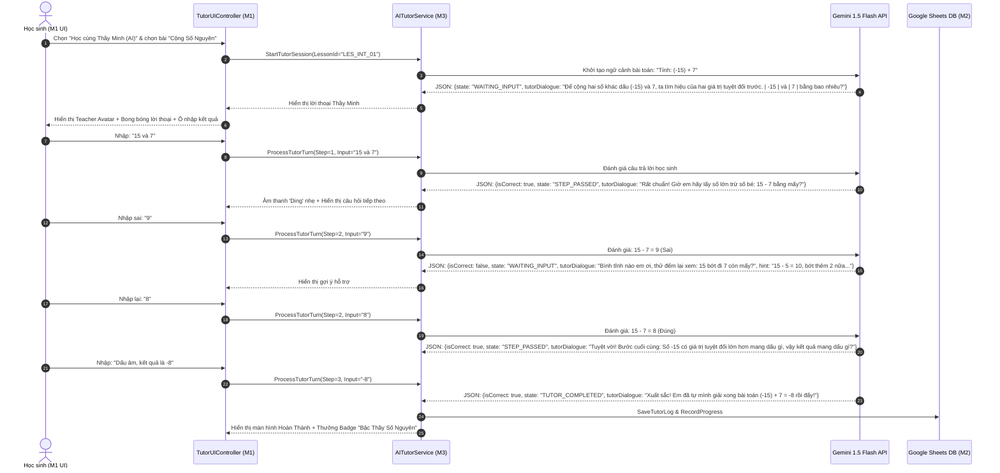

Listed directory Math6-AI-Companion

## 1. Scope Evaluation & Risk Analysis

Before designing the architecture, we evaluated the technical constraints of a **3-student university team working over 8–9 weeks**. The original requirements contain several high-risk bottlenecks that could lead to project failure if attempted naively.

```
+---------------------------------------------------------------------------------------+
|                                    RISK RADAR                                         |
+------------------------------+--------------+-------------------+---------------------+
| Risk Item                    | Risk Level   | Failure Mode      | Proposed Mitigation |
+------------------------------+--------------+-------------------+---------------------+
| 1. Direct Sheets API in C#   | 🔴 CRITICAL  | IL2CPP/C# DLL     | Google Apps Script  |
|    (Google.Apis.Sheets)      |              | dependency hell   | REST Proxy (JSON)   |
| 2. Handwritten Math OCR      | 🔴 HIGH      | Camera texture &  | Virtual Math Keypad |
|    in Unity                  |              | LaTeX parsing bug | + Text Step Input   |
| 3. Unbounded 3D RPG World    | 🟡 MEDIUM    | M1 overwhelmed,   | Focused 2.5D/3D     |
|                              |              | zero UI time      | Single Classroom    |
| 4. AI Tutor State Drift      | 🔴 CRITICAL  | LLM gives answer  | JSON State Machine  |
|    (Stateless Prompts)       |              | prematurely       | with Step Indices   |
| 5. Security of Sheets DB     | 🟡 MEDIUM    | Plaintext creds & | SHA-256 Hash +      |
|                              |              | API key leak      | Web App Proxy Auth  |
+------------------------------+--------------+-------------------+---------------------+
```

### Critical Risks & Architectural Decisions

1. **Google Sheets Integration via Official SDK vs. Google Apps Script (GAS) Web App**
   * *The Problem*: Integrating `Google.Apis.Sheets.v4` and `Google.Apis.Auth` directly inside Unity C# requires large NuGet assemblies that break IL2CPP builds, fail on WebGL, and require distributing OAuth credentials inside the compiled game.
   * *The Fix*: Deploy a **Google Apps Script Web App** acting as a serverless REST API gateway. Unity communicates with standard `UnityWebRequest` (JSON POST/GET). Google Apps Script accesses `SpreadsheetApp` natively in milliseconds with zero third-party C# DLLs.
2. **Handwritten OCR vs. Structured Step Input**
   * *The Problem*: Mobile/Webcam camera texture capture in Unity, perspective transformation, and Vietnamese handwritten mathematical OCR via Vision API are prone to high failure rates and take 3–4 weeks to stabilize.
   * *The Fix*: For the 9-week MVP, provide a **Structured Multi-Step Text Input UI with a Virtual Math Keypad** (supporting fractions `a/b`, exponents `x^n`, signs `±`, parentheses `()`, multiplication `*` or `·`). File upload of student work is kept as an optional secondary attachment.
3. **Over-scoped 3D RPG Environment**
   * *The Problem*: Modeling a multi-room school, character animations, pathfinding, and collision will consume all of Member 1's bandwidth, leaving no time for the Quiz UI, AI Tutor dialogue box, Teacher Dashboard, and Badge screens.
   * *The Fix*: Confine the gameplay to a **single, polished 2.5D or 3D Mathematics Classroom** with 3 distinct interactive trigger zones:
     * *Zone A (Student Desk)*: Topic/Lesson selection, MCQ Quizzes, Essay Exercises.
     * *Zone B (Teacher Podium / Whiteboard)*: Interactive Step-by-Step AI Tutor.
     * *Zone C (Notice Board / Desk)*: Progress Tracking, Badges, and Teacher Dashboard.
4. **AI Tutor Hallucination & premature answer leakage**
   * *The Problem*: If the AI is prompted generically as a tutor, LLMs frequently skip ahead and output the final solution when the student says "I don't know" or provides a wrong answer.
   * *The Fix*: Implement a **Deterministic Turn-Based State Machine**. The game passes the current `Problem`, `CurrentStepIndex`, `TotalSteps`, and `StudentAnswer` to Gemini. The system prompt forces strict JSON output with `state: "WAITING_INPUT" | "STEP_PASSED" | "TUTOR_COMPLETED"` and forbids revealing subsequent steps.

---

## 2. Revised MVP vs. Optional Features

| Feature Area | In-Scope MVP (Week 1 – Week 8) | Out-of-Scope / Optional (Week 9+) |
| :--- | :--- | :--- |
| **Environment** | 1 Polished Math Classroom scene; WASD movement; 3 interaction hot-spots; Camera follow. | Multi-room school, NPCs walking around, Day/Night cycle, Minimap. |
| **Authentication** | Student/Teacher login via Google Sheets with SHA-256 password hash; persistent session in `PlayerPrefs`. | Registration form inside game (admin seeds users in Sheet), Google OAuth SSO. |
| **Math Curriculum** | Grade 6 Vietnamese Math: **Topic 1: Số nguyên (Integers)** & **Topic 2: Phân số (Fractions)**. | Full textbook (all 8 topics). |
| **Question Bank** | 30+ MCQs, 10+ Multi-step problems stored in Google Sheets with DRAFT/REVIEWED/PUBLISHED status. | 500+ questions, automated web scraping. |
| **AI Tutor** | Interactive Socratic method (1 step at a time, checks answer, hints on error, advances only when correct). | Real-time speech synthesis (TTS) & voice recognition (STT). |
| **Essay / Step Input** | Multi-step text editor with virtual math keypad + AI rubric-based evaluation. | Live webcam handwritten OCR image processing. |
| **Teacher Portal** | In-game Teacher UI for monitoring student attempts, averages, mistake logs, and AI feedback. | Web-based React teacher portal (Sheets UI acts as external portal). |
| **Badges** | 6 Core badges awarded automatically based on stored thresholds. | 50+ cosmetics, avatar customization store. |

---

## 3. System Architecture & Bridge Design

```
+----------------------------------------------------------------------------------------------------+
|                                    CLIENT TIER: UNITY (C#)                                         |
|                                                                                                    |
|  [Character / Scene Controller]    [Dialogue / Tutor UI]    [Quiz & Step UI]    [Teacher Dashboard] |
|              │                               │                      │                     │        |
|  ────────────┼───────────────────────────────┴──────────────────────┴─────────────────────┼──────  |
|              ▼                                                                            ▼        |
|     [GameManager & EventBus] ───────────► [Mock Service Layer] ◄──────────────► [Service Layer]    |
|                                                    │                                      │        |
|                                                    ▼                                      ▼        |
|                                            (ScriptableObjects)                [NetworkBridge: C#]  |
+---------------------------------------------------------------------------------------┬────────────+
                                                                                        │ HTTPS (JSON)
                                 ┌──────────────────────────────────────────────────────┴───────────┐
                                 ▼                                                                  ▼
+─────────────────────────────────────────────────────────+      +──────────────────────────────────+
|           DATA BACKEND: GOOGLE APPS SCRIPT              |      |         AI ENGINE: GEMINI API    |
|                     (doGet / doPost)                    |      |                                  |
|   - AuthenticateUser(user, passHash)                    |      |   - Math Problem Generator       |
|   - GetQuestions(topic, difficulty)                     |      |   - Step-by-Step AI Tutor        |
|   - SubmitResult(studentId, score, details)             |      |   - Rubric Multi-step Grader     |
|   - GetTeacherAnalytics(classId)                        |      |   - Arithmetic Error Diagnoser   |
+────────────────────────────┬────────────────────────────+      +──────────────────────────────────+
                             │ Sheets API v4 (Native)
                             ▼
+───────────────────────────────────────────────────────────────────────────────────────────────────+
|                                    DATABASE: GOOGLE SHEETS                                        |
|  [Users]  [Questions_Math6]  [Lessons]  [Results]  [Progress]  [Badges]  [StudentBadges]  [AI_Logs]   |
+---------------------------------------------------------------------------------------------------+
```

### Communication Bridge Strategy
* **Direct Mode vs. Proxy Mode**:
  * Unity calls **Google Apps Script Web App** for database operations (User, Results, Badges, Questions).
  * For the **AI Tutor & Grading**, Unity calls the Gemini API directly using an API Key configured in `AppConfig.json` (or calls Apps Script as an AI proxy to hide the key).
* **Network Fault Tolerance**: All Unity service calls run through an asynchronous `NetworkClient` wrapper with timeout handling, exponential backoff (up to 3 retries), and fallback to cached local mock data if offline.

---

## 4. Data & Interface Contracts (Strict JSON Specifications)

To enable **M1 (Gameplay/UI)**, **M2 (Data/Sheets)**, and **M3 (AI/Pedagogy)** to write code from Day 1 without blocking each other, the following contracts are strictly frozen.

### 4.1 Authentication Contract (`POST /exec?action=login`)
* **Request (Unity -> Backend)**:
```json
{
  "action": "login",
  "username": "student_an",
  "passwordHash": "a665a45920422f9d417e4867efdc4fb8a04a1f3fff1fa07e998e86f7f7a27ae3"
}
```
* **Response (Backend -> Unity)**:
```json
{
  "success": true,
  "statusCode": 200,
  "message": "Login successful",
  "data": {
    "userId": "STU_001",
    "username": "student_an",
    "fullName": "Nguyen Van An",
    "role": "STUDENT",
    "grade": 6,
    "classId": "6A1"
  }
}
```

### 4.2 Question Retrieval Contract (`GET /exec?action=getQuestions&topic=Integers&grade=6`)
* **Response (Backend -> Unity)**:
```json
{
  "success": true,
  "questions": [
    {
      "questionId": "Q_INT_001",
      "type": "MCQ",
      "topic": "Integers",
      "lesson": "Phép cộng số nguyên",
      "difficulty": "EASY",
      "prompt": "Tính giá trị của biểu thức: (-15) + 7",
      "options": {
        "A": "8",
        "B": "-8",
        "C": "22",
        "D": "-22"
      },
      "correctOption": "B",
      "explanation": "Cộng hai số nguyên khác dấu: lấy số có giá trị tuyệt đối lớn hơn trừ số bé hơn và đặt dấu của số lớn hơn trước kết quả. 15 - 7 = 8, kết quả là -8."
    },
    {
      "questionId": "Q_INT_002",
      "type": "ESSAY",
      "topic": "Integers",
      "lesson": "Thứ tự thực hiện phép tính",
      "difficulty": "MEDIUM",
      "prompt": "Tính giá trị biểu thức từng bước: 15 - (3 + 2) * 2",
      "rubric": [
        {"step": 1, "description": "Tính trong ngoặc (3 + 2) = 5", "points": 3},
        {"step": 2, "description": "Thực hiện phép nhân 5 * 2 = 10", "points": 4},
        {"step": 3, "description": "Thực hiện phép trừ 15 - 10 = 5", "points": 3}
      ],
      "maxScore": 10
    }
  ]
}
```

### 4.3 AI Tutor Step-by-Step Contract
* **Payload sent to AI Engine**:
```json
{
  "problemStatement": "Tính giá trị biểu thức: 15 - (3 + 2) * 2",
  "totalSteps": 3,
  "currentStepIndex": 1,
  "studentInput": "Phép tính trong ngoặc (3 + 2)",
  "conversationHistory": [
    {"role": "tutor", "text": "Chào em! Với biểu thức 15 - (3 + 2) * 2, theo thứ tự thực hiện phép tính, chúng ta phải làm phần nào trước?"}
  ]
}
```
* **Enforced AI JSON Response**:
```json
{
  "isCorrect": true,
  "scoreDelta": 3,
  "state": "STEP_PASSED",
  "tutorDialogue": "Chính xác! Ta ưu tiên tính trong ngoặc trước. Vậy (3 + 2) bằng bao nhiêu?",
  "hint": "Cộng 3 với 2 đơn giản nhé.",
  "highlightFormula": "(3 + 2) = ?",
  "nextStepIndex": 2,
  "shouldWaitForStudent": true,
  "isLessonCompleted": false
}
```
* **If Student answers wrong (e.g., student answers "15 - 3")**:
```json
{
  "isCorrect": false,
  "scoreDelta": 0,
  "state": "WAITING_INPUT",
  "tutorDialogue": "Chưa đúng rồi em ơi! Em đang làm phép trừ trước mất rồi. Em nhớ quy tắc: 'Trong ngoặc trước, ngoài ngoặc sau; nhân chia trước, cộng trừ sau' không nào?",
  "hint": "Quan sát dấu ngoặc tròn (3 + 2) xem nào.",
  "highlightFormula": "Quy tắc: Ngoặc () -> Nhân/Chia -> Cộng/Trừ",
  "nextStepIndex": 1,
  "shouldWaitForStudent": true,
  "isLessonCompleted": false
}
```

### 4.4 Multi-Step Essay Grading Contract
* **Request**:
```json
{
  "questionId": "Q_INT_002",
  "studentSubmission": "Bước 1: 3 + 2 = 5\nBước 2: 15 - 5 = 10\nBước 3: 10 * 2 = 20",
  "rubricId": "RUB_INT_002"
}
```
* **AI Structured Response**:
```json
{
  "score": 3,
  "maxScore": 10,
  "passed": false,
  "detectedMistakeType": "ORDER_OF_OPERATIONS_ERROR",
  "stepAnalysis": [
    {"step": 1, "isCorrect": true, "comment": "Tính đúng trong ngoặc (3+2)=5"},
    {"step": 2, "isCorrect": false, "comment": "Sai thứ tự: Lấy 15 trừ 5 trước khi nhân với 2"},
    {"step": 3, "isCorrect": false, "comment": "Kết quả cuối bị sai do lỗi dây chuyền từ bước 2"}
  ],
  "pedagogicalFeedback": "Em đã làm đúng bước tính trong ngoặc! Tuy nhiên ở bước 2, biểu thức còn lại là 15 - 5 * 2, em cần ưu tiên thực hiện phép nhân 5 * 2 trước khi lấy 15 trừ đi nhé!",
  "remedialExercise": "Thử tính lại biểu thức đơn giản hơn: 10 - 2 * 3"
}
```

### 4.5 Save Result & Badge Contract (`POST /exec?action=saveResult`)
* **Request**:
```json
{
  "action": "saveResult",
  "userId": "STU_001",
  "lessonId": "LES_INT_01",
  "score": 10,
  "maxScore": 10,
  "timeSpentSeconds": 180,
  "mistakesCount": 0,
  "activityType": "MCQ"
}
```
* **Response**:
```json
{
  "success": true,
  "newBadgesAwarded": [
    {
      "badgeId": "BADGE_PERFECT",
      "badgeName": "Nhà Tính Toán Hoàn Hảo",
      "description": "Đạt điểm tối đa 10/10 trong một bài kiểm tra",
      "icon": "icon_star_gold"
    }
  ],
  "updatedProgress": {
    "totalCompletedLessons": 3,
    "averageScore": 9.2
  }
}
```

---

## 5. Google Sheets Database Schema

The Google Spreadsheet acts as the relational database. Each sheet is a database table with explicit primary keys and column types.

```
+-----------------------------------------------------------------------------------------------------+
|                                      GOOGLE SHEETS SCHEMA                                           |
+-------------------+---------------------------------------------------------------------------------+
| Sheet Name        | Columns (Header Row 1)                                                          |
+-------------------+---------------------------------------------------------------------------------+
| Users             | UserID | Username | PasswordHash | Role | FullName | Grade | ClassID | CreatedAt    |
| Lessons           | LessonID | Topic | Title | Grade | OrderIndex | Summary | Objectives            |
| Questions_Math6   | QuestionID | LessonID | Topic | Type | Difficulty | Prompt | OptA | OptB | OptC |
|                   | OptD | CorrectAnswer | RubricJSON | Explanation | Status (DRAFT/PUBLISHED)        |
| Results           | ResultID | UserID | LessonID | ActivityType | Score | MaxScore | TimeSpentSec |
|                   | MistakesCount | SubmittedAt                                                         |
| Progress          | ProgressID | UserID | LessonID | Attempts | HighestScore | LastScore | Completed |
|                   | LastAttemptDate                                                                 |
| Badges            | BadgeID | BadgeCode | Name | Description | IconURL | ConditionType | Threshold    |
| StudentBadges     | UserBadgeID | UserID | BadgeID | UnlockedAt                                         |
| AI_Tutor_Logs     | LogID | UserID | QuestionID | StepIndex | StudentInput | AIResponseJSON | Timestamp|
+-------------------+---------------------------------------------------------------------------------+
```

### Seed Data Reference Samples
* **Users**:
  * `STU_001 | student01 | <hash> | STUDENT | Tran Minh Khoa | 6 | 6A1 | 2026-09-01`
  * `TEA_001 | teacher01 | <hash> | TEACHER | Nguyen Thi Mai | 6 | 6A1 | 2026-09-01`
* **Badges Definition**:
  * `B01 | FIRST_LESSON | Khởi Đầu Nan | Hoàn thành bài học đầu tiên | badge_01 | LESSONS_COUNT | 1`
  * `B02 | PERFECT_SCORE | Tính Toán Siêu Đẳng | Đạt điểm 10 tuyệt đối | badge_02 | SCORE_MAX | 10`
  * `B03 | FRACTION_MASTER | Bậc Thầy Phân Số | Hoàn thành chuyên đề Phân số | badge_03 | TOPIC_COMPLETE | Fractions`
  * `B04 | PERSISTENCE | Vượt Lên Sai Lầm | Hoàn thành bài sau 2 lần làm lại | badge_04 | RETRY_SUCCESS | 1`

### Google Apps Script API Implementation (Core Gateway)
Save this script directly into **Extensions > Apps Script** in Google Sheets and Deploy as a Web App (`Execute as: Me`, `Who has access: Anyone`).

```javascript
// Google Apps Script Code (Code.gs)
function doGet(e) {
  return handleRequest(e);
}

function doPost(e) {
  return handleRequest(e);
}

function handleRequest(e) {
  const lock = LockService.getScriptLock();
  lock.tryLock(10000);
  try {
    let params = e.parameter;
    let postData = {};
    if (e.postData && e.postData.contents) {
      postData = JSON.parse(e.postData.contents);
    }
    const action = params.action || postData.action;
    const ss = SpreadsheetApp.getActiveSpreadsheet();

    if (action === "login") {
      const usersSheet = ss.getSheetByName("Users");
      const data = usersSheet.getDataRange().getValues();
      for (let i = 1; i < data.length; i++) {
        if (data[i][1] == postData.username && data[i][2] == postData.passwordHash) {
          return respondJSON({
            success: true,
            data: { userId: data[i][0], username: data[i][1], role: data[i][3], fullName: data[i][4], grade: data[i][5] }
          });
        }
      }
      return respondJSON({ success: false, message: "Sai tên đăng nhập hoặc mật khẩu" });
    }

    if (action === "getQuestions") {
      const qSheet = ss.getSheetByName("Questions_Math6");
      const data = qSheet.getDataRange().getValues();
      const topic = params.topic;
      const results = [];
      for (let i = 1; i < data.length; i++) {
        if (data[i][13] === "PUBLISHED" && (!topic || data[i][2] === topic)) {
          results.push({
            questionId: data[i][0],
            lessonId: data[i][1],
            topic: data[i][2],
            type: data[i][3],
            difficulty: data[i][4],
            prompt: data[i][5],
            options: { A: data[i][6], B: data[i][7], C: data[i][8], D: data[i][9] },
            correctAnswer: data[i][10],
            rubric: data[i][11] ? JSON.parse(data[i][11]) : [],
            explanation: data[i][12]
          });
        }
      }
      return respondJSON({ success: true, questions: results });
    }

    if (action === "saveResult") {
      const resSheet = ss.getSheetByName("Results");
      const progSheet = ss.getSheetByName("Progress");
      const resId = "RES_" + new Date().getTime();
      resSheet.appendRow([
        resId, postData.userId, postData.lessonId, postData.activityType,
        postData.score, postData.maxScore, postData.timeSpentSeconds,
        postData.mistakesCount, new Date().toISOString()
      ]);
      // Update Progress and Check Badges logic
      return respondJSON({ success: true, resultId: resId });
    }

    return respondJSON({ success: false, message: "Action không hợp lệ" });
  } catch (err) {
    return respondJSON({ success: false, error: err.toString() });
  } finally {
    lock.releaseLock();
  }
}

function respondJSON(data) {
  return ContentService.createTextOutput(JSON.stringify(data)).setMimeType(ContentService.MimeType.JSON);
}
```

---

## 6. AI Architecture & 6th-Grade Math Prompt Engineering

### 6.1 Architectural Workflow
1. **Student Input** in Unity -> Formatted into JSON Context.
2. **Context Packager**: Combines Grade 6 Math Curriculum Guidelines, strict pedagogical constraints, current step number, and expected step.
3. **Gemini API Execution** (`gemini-1.5-flash` or `gemini-2.0-flash` for low latency <1s).
4. **JSON Sanitizer & Validator**: C# parses response into `AITutorStepResponse`. If JSON is malformed, falls back to pre-compiled local pedagogical hints.

### 6.2 The Socratic AI Tutor Prompt (Grade 6 Mathematics)

```markdown
SYSTEM PROMPT:
Bạn là "Thầy Minh" - Giáo viên AI dạy Toán lớp 6 thân thiện, kiên nhẫn, chuẩn sư phạm Việt Nam.
Nhiệm vụ của bạn là hướng dẫn học sinh giải bài toán TỪNG BƯỚC MỘT theo phương pháp đàm thoại gợi mở (Socratic Tutoring).

QUY TẮC BẮT BUỘC:
1. TUYỆT ĐỐI KHÔNG giải hết bài toán trong một lần.
2. TUYỆT ĐỐI KHÔNG đưa ra đáp án cuối cùng trừ khi học sinh đã tự tính xong bước áp chót.
3. Mỗi lượt phản hồi, bạn CHỈ ĐƯỢC PHÉP hỏi đúng 1 câu hỏi hoặc kiểm tra 1 phép tính nhỏ.
4. Khi học sinh trả lời SAI:
   - Không được chê bai hay nói "Sai rồi, đáp án là...".
   - Chỉ ra điểm nhầm lẫn cụ thể (ví dụ: nhầm dấu âm/dương, quên nhân tử phụ khi quy đồng, tính cộng trước nhân).
   - Đưa ra 1 gợi ý ngắn hoặc quy tắc nhớ nhanh.
   - Yêu cầu học sinh tính lại đúng bước đó.
5. Khi học sinh trả lời ĐÚNG:
   - Khen ngợi ngắn gọn (ví dụ: "Chính xác!", "Rất tốt!").
   - Xác nhận kết quả trung gian và chuyển sang bước tiếp theo.
6. Ngôn ngữ: Tiếng Việt trong sáng, phù hợp với học sinh 11-12 tuổi.
7. ĐỊNH DẠNG ĐẦU RA: Bắt buộc chỉ trả về DUY NHẤT một JSON hợp lệ (không có markdown backticks ```json):

{
  "isCorrect": boolean,
  "state": "WAITING_INPUT" | "STEP_PASSED" | "TUTOR_COMPLETED",
  "tutorDialogue": "Lời thoại của thầy gửi học sinh",
  "hint": "Gợi ý ngắn khi học sinh lúng túng",
  "highlightFormula": "Công thức toán cần lưu ý (hoặc rỗng)",
  "nextStepIndex": number,
  "shouldWaitForStudent": boolean,
  "isLessonCompleted": boolean
}
```

### 6.3 Multi-Step Math Grading & Rubric Prompt

```markdown
SYSTEM PROMPT:
Bạn là Giám khảo AI chấm điểm bài thi tự luận môn Toán Lớp 6 theo thang điểm chuẩn của Bộ Giáo dục.
Bạn sẽ nhận:
1. Đề bài và Biểu điểm/Rubric chi tiết từng bước.
2. Lời giải chi tiết của học sinh (gồm các bước tính).

Nhiệm vụ:
- Phân tích từng dòng trong bài làm của học sinh.
- Đối chiếu với từng tiêu chí trong Rubric.
- Phát hiện các lỗi toán học điển hình: Lỗi cộng trừ số nguyên, lỗi nhân chia trước cộng trừ sau, lỗi cộng tử với tử mẫu với mẫu khi cộng phân số, lỗi chuyển vế đổi dấu.
- Nếu học sinh sai ở bước k, không cho điểm bước k, nhưng nếu các bước sau làm đúng về mặt logic dựa trên kết quả sai của bước k (lỗi dây chuyền), ghi chú rõ.
- TRẢ VỀ DUY NHẤT MỘT JSON:
{
  "score": number,
  "maxScore": number,
  "passed": boolean,
  "detectedMistakeType": "ORDER_OF_OPERATIONS" | "SIGN_ERROR" | "FRACTION_DENOMINATOR" | "ARITHMETIC" | "NONE",
  "stepAnalysis": [
    {
      "step": number,
      "isCorrect": boolean,
      "comment": "Nhận xét ngắn gọn từng bước"
    }
  ],
  "pedagogicalFeedback": "Lời giải thích sư phạm chỉ rõ nguyên nhân sai và cách khắc phục",
  "remedialExercise": "Một bài toán tương tự ngắn để luyện lại lỗi sai"
}
```

---

## 7. Unity Architecture, Folder Structure & Scene Management

### 7.1 Unity Folder Structure (`Assets/`)
```
Assets/
├── _Project/
│   ├── Animations/
│   │   ├── Characters/          # Student & Teacher Walk, Idle, Talk
│   │   └── UI/                  # Popup, Fade, Badge Unlock animations
│   ├── Audio/
│   │   ├── BGM/                 # Classroom background acoustic music
│   │   └── SFX/                 # Correct, Wrong, Click, Badge_Chime
│   ├── Materials/
│   ├── Prefabs/
│   │   ├── Characters/          # StudentPlayer, TeacherNPC
│   │   ├── UI/                  # DialogueBubble, QuestionCard, KeypadButton
│   │   └── Environment/         # Desk, Blackboard, NoticeBoard, Bookshelf
│   ├── Scenes/
│   │   ├── 00_Bootstrapper.unity# System init, network check, persistent managers
│   │   ├── 01_Login.unity       # Student / Teacher authentication
│   │   ├── 02_Classroom.unity   # Core 2.5D/3D interactive classroom environment
│   │   └── 03_TeacherDesk.unity # Dedicated teacher analytics dashboard scene
│   ├── ScriptableObjects/
│   │   ├── Questions/           # Local fallback question assets
│   │   ├── Badges/              # Badge metadata definitions
│   │   └── Lessons/             # Lesson topic hierarchies
│   ├── Scripts/
│   │   ├── Core/
│   │   │   ├── GameManager.cs
│   │   │   ├── EventBus.cs
│   │   │   └── AppConstants.cs
│   │   ├── Data/
│   │   │   ├── Models/          # UserData, QuestionData, ResultData
│   │   │   └── LocalCache.cs
│   │   ├── Gameplay/
│   │   │   ├── PlayerController.cs
│   │   │   ├── NPCInteraction.cs
│   │   │   └── InteractionZone.cs
│   │   ├── Network/
│   │   │   ├── INetworkService.cs
│   │   │   ├── GoogleSheetsClient.cs
│   │   │   ├── GeminiClient.cs
│   │   │   └── MockNetworkService.cs
│   │   ├── Quiz/
│   │   │   ├── QuizController.cs
│   │   │   ├── MCQHandler.cs
│   │   │   └── EssayHandler.cs
│   │   ├── Tutor/
│   │   │   ├── AITutorController.cs
│   │   │   ├── TutorDialogueUI.cs
│   │   │   └── TutorStateMachine.cs
│   │   └── UI/
│   │       ├── VirtualMathKeypad.cs
│   │       ├── BadgeNotificationUI.cs
│   │       ├── StudentProgressUI.cs
│   │       └── TeacherDashboardUI.cs
│   └── Textures/
│       ├── UI/
│       └── Sprites/
└── Plugins/                     # Minimal JSON parsing helpers (e.g. Newtonsoft.Json)
```

### 7.2 Scene Flow Diagram
```
[00_Bootstrapper] 
       │ (Load Core Managers: Audio, Network, UserSession)
       ▼
  [01_Login] ──── (Role == TEACHER) ────► [03_TeacherDesk] (Analytics/Question Mgt)
       │
 (Role == STUDENT)
       ▼
 [02_Classroom] (Player walks in 2.5D/3D room)
       ├── Trigger: Student Desk ────► UI Popup: [Lesson & Quiz Screen]
       ├── Trigger: Whiteboard   ────► UI Popup: [Interactive AI Tutor]
       └── Trigger: Notice Board ────► UI Popup: [Badges & Personal Progress]
```

---

## 8. C# Class Architecture & Sequence Diagrams

### 8.1 Core C# Interfaces for Parallel Development

```csharp
// INetworkService.cs - Shared between Member 1 and Member 2
public interface INetworkService
{
    void Login(string username, string passwordHash, Action<bool, UserData, string> onComplete);
    void GetQuestions(string topic, string difficulty, Action<bool, List<QuestionData>> onComplete);
    void SaveResult(ResultSubmission submission, Action<bool, List<BadgeData>> onComplete);
    void GetStudentAnalytics(string studentId, Action<bool, StudentAnalyticsData> onComplete);
}

// IAITutorService.cs - Shared between Member 1 and Member 3
public interface IAITutorService
{
    void ProcessTutorTurn(TutorTurnPayload payload, Action<bool, AITutorStepResponse> onComplete);
    void GradeEssaySubmission(EssaySubmissionPayload payload, Action<bool, AIGradingResponse> onComplete);
}

// Models.cs
[System.Serializable]
public class UserData {
    public string userId;
    public string username;
    public string fullName;
    public string role;
    public int grade;
}

[System.Serializable]
public class AITutorStepResponse {
    public bool isCorrect;
    public string state; // "WAITING_INPUT", "STEP_PASSED", "TUTOR_COMPLETED"
    public string tutorDialogue;
    public string hint;
    public string highlightFormula;
    public int nextStepIndex;
    public bool shouldWaitForStudent;
    public bool isLessonCompleted;
}
```

### 8.2 Sequence Diagram: Interactive Socratic AI Tutor Session



---

## 9. Comprehensive Task Breakdown for 3 Team Members

Per the specification, every task is classified by dependency:
* 🔵 **Independent** (can be built immediately with mock data)
* 🟡 **Requires Interface Contract** (needs frozen JSON/C# interface)
* 🔴 **Requires Integration** (merges systems from multiple members)

### Member 1: Unity Gameplay & UI Lead (M1)

| Task ID | Task Name | Priority | Effort | Dep. | Indep? | Input | Output | Definition of Done (DoD) | Deliverable |
| :--- | :--- | :--- | :--- | :--- | :--- | :--- | :--- | :--- | :--- |
| **U-01** | Classroom Scene & Top-Down Movement | 🔴 High | 3 days | None | 🔵 Yes | Unity 2D/3D Assets | Player Controller | Player walks with WASD/Virtual Joystick; camera follows smoothly; bounds respected. | `Classroom.unity` + `PlayerController.cs` |
| **U-02** | Interactive Zones & NPC Triggers | 🔴 High | 2 days | U-01 | 🔵 Yes | Collision colliders | Event triggers | Proximity prompt "[E] Tương tác" appears when near Desk, Teacher, Board. | `InteractionZone.cs` |
| **U-03** | Main Menu & Login UI | 🟡 Med | 2 days | None | 🟡 Yes | Auth Contract | Login Screen | Inputs for username/password; error label; invokes `INetworkService.Login`. | `LoginUIController.cs` |
| **U-04** | MCQ Quiz Interface | 🔴 High | 3 days | None | 🟡 Yes | `MockQuestionData` | Quiz UI Prefab | Displays Question prompt, 4 option buttons, timer, next button, feedback toast. | `QuizUIController.cs` |
| **U-05** | Virtual Math Keypad & Step Input | 🔴 High | 3 days | None | 🔵 Yes | Math symbols layout | Keypad Prefab | Clickable buttons (`+`, `-`, `*`, `/`, `^`, `()`) append to input field; mobile friendly. | `VirtualMathKeypad.cs` |
| **U-06** | Socratic Dialogue & Tutor UI | 🔴 High | 4 days | None | 🟡 Yes | `MockAIResponse` | Tutor Chat Window | Teacher portrait, animated speech bubbles, step progress bar, hint accordion. | `TutorDialogueUI.cs` |
| **U-07** | Student Badges & Progress UI | 🟡 Med | 2 days | None | 🟡 Yes | `MockBadgeData` | Badge Screen | Grid of locked/unlocked badge icons; progress bars for topics; achievement popup. | `BadgeUIController.cs` |
| **U-08** | Teacher Analytics Dashboard UI | 🟡 Med | 3 days | None | 🟡 Yes | `MockTeacherData` | Teacher Screen | Table of student list, attempt counts, average scores, view mistake details popup. | `TeacherDashboardUI.cs` |
| **U-09** | Full Client Integration & Polish | 🔴 High | 5 days | U-01 to U-08 | 🔴 No | Real APIs (M2, M3) | Shipped Build | All mock services switched to `NetworkClient`; zero UI overflow bugs; sound FX added. | Standalone/WebGL Game Build |

---

### Member 2: Google Sheets, Data & Authentication Lead (M2)

| Task ID | Task Name | Priority | Effort | Dep. | Indep? | Input | Output | Definition of Done (DoD) | Deliverable |
| :--- | :--- | :--- | :--- | :--- | :--- | :--- | :--- | :--- | :--- |
| **D-01** | Google Sheets Schema & Database Setup | 🔴 High | 2 days | None | 🔵 Yes | Schema spec | 8 Sheet Tabs | All 8 sheets created with headers, data validation rules, formulas, and seed data. | Google Sheet Link with seed rows |
| **D-02** | Google Apps Script Auth Web App | 🔴 High | 2 days | D-01 | 🟡 Yes | Auth Contract | HTTP POST `/login` | Hashes password, checks `Users` sheet, returns user session JSON with role. | Deployed GAS Web App URL |
| **D-03** | Question Bank Retrieval API | 🔴 High | 2 days | D-01 | 🟡 Yes | Quiz Contract | HTTP GET `/questions` | Returns filtered PUBLISHED questions by Topic and Grade in valid JSON. | Tested Postman/cURL endpoint |
| **D-04** | Result & Progress Persistence API | 🔴 High | 3 days | D-01 | 🟡 Yes | Result Contract | HTTP POST `/saveResult` | Inserts row into `Results`, recalculates `Progress` aggregates, returns badge triggers. | Tested GAS function |
| **D-05** | Badge Engine & Trigger Logic | 🟡 Med | 2 days | D-04 | 🟡 Yes | Badge Rules | Trigger Evaluation | Evaluates conditions (e.g. Score=10 -> award B02) and writes to `StudentBadges`. | Apps Script Trigger Module |
| **D-06** | Teacher Analytics Query API | 🟡 Med | 2 days | D-01 | 🟡 Yes | Dashboard Contract | HTTP GET `/analytics` | Aggregates student attempts, failure frequencies per question, class averages. | Working Analytics API Endpoint |
| **D-07** | Unity C# `GoogleSheetsClient` Wrapper | 🔴 High | 3 days | D-02 to D-06 | 🔴 No | `INetworkService` | C# Network Class | Implements `INetworkService` using `UnityWebRequest` with coroutines / async-await. | `GoogleSheetsClient.cs` |
| **D-08** | End-to-End Stress & Fallback Testing | 🟡 Med | 2 days | D-07 | 🔴 No | Unity Game Scene | Test Report | Verifies 20 concurrent requests; validates local offline caching when WiFi disconnects. | `DataIntegrationTests.cs` |

---

### Member 3: AI Engine, Prompts & Pedagogical Logic Lead (M3)

| Task ID | Task Name | Priority | Effort | Dep. | Indep? | Input | Output | Definition of Done (DoD) | Deliverable |
| :--- | :--- | :--- | :--- | :--- | :--- | :--- | :--- | :--- | :--- |
| **AI-01** | Grade 6 Math Curriculum Prompt Design | 🔴 High | 3 days | None | 🔵 Yes | SGK Toán 6 | System Prompts | Crafted system prompt adhering to VN 6th grade pedagogical order of operations & fractions. | Prompt specification doc |
| **AI-02** | Socratic AI Tutor Prompt & State Machine | 🔴 High | 3 days | AI-01 | 🟡 Yes | Tutor Contract | Enforced JSON prompt | Gemini consistently returns single step, waits for student, gives hints on wrong input. | Tested Google AI Studio Prompts |
| **AI-03** | Math Question Generator & Validator | 🟡 Med | 2 days | AI-01 | 🔵 Yes | Topic specifications | Batch Generator | Generates 20 MCQs and 10 Essays with rubrics; script auto-verifies math calculations. | Python/Node Generator Script |
| **AI-04** | Multi-Step Essay Grading & Rubric Prompt | 🔴 High | 3 days | AI-01 | 🟡 Yes | Grading Contract | Scoring prompt | Diagnoses specific mistakes (`SIGN_ERROR`, `ORDER_OF_OPERATIONS`) and awards partial points. | Evaluated Rubric Benchmark |
| **AI-05** | Unity C# `GeminiClient` Integration | 🔴 High | 3 days | AI-02, AI-04 | 🟡 Yes | C# Interface | `GeminiClient.cs` | Sends REST payload to `https://generativelanguage.googleapis.com`, parses structured JSON. | `GeminiClient.cs` |
| **AI-06** | Remedial & Wrong-Answer Recovery Engine | 🟡 Med | 2 days | AI-05 | 🔴 No | Student Mistake Log | Dynamic Hints | Generates simplified analog question when student fails the same step twice. | `AdaptiveHintEngine.cs` |
| **AI-07** | Curated Seed Question Bank Validation | 🔴 High | 2 days | D-01 | 🔴 No | Sheets DB | 40 Verified Questions | Imports 30 MCQs and 10 multi-step essays into `Questions_Math6` with status `PUBLISHED`. | Populated Google Sheets Tab |

---

## 10. 9-Week Development Plan & Milestones

```
+-------------------------------------------------------------------------------------------------------------+
|                                           9-WEEK SPRINT ROADMAP                                             |
+------+--------------------------+------------------------------+--------------------------------------------+
| Week | Member 1 (Gameplay / UI) | Member 2 (Data / Sheets)     | Member 3 (AI / Pedagogy)                   |
+------+--------------------------+------------------------------+--------------------------------------------+
| W1   | U-01: Movement & Scene   | D-01: Google Sheets Schema   | AI-01: System Prompt Design                |
|      | U-02: Interaction Zones  | Freeze Data Contracts        | Freeze AI Tutor Contracts                  |
| W2   | U-03: Login & Menu UI    | D-02: Apps Script Auth       | AI-02: Socratic Tutor Prompt Prototype     |
|      | Mock Network Client      | D-03: Question Retrieval API | AI-03: Math Question Generator Script      |
| W3   | U-04: MCQ Quiz UI        | D-04: Save Result API        | AI-04: Multi-step Rubric Grader Prototype  |
|      | Question Card Navigation | D-05: Badge Trigger Engine   | Build 20 Seed Questions                    |
| W4   | [LAB 1 CHECKPOINT]       | [LAB 1 CHECKPOINT]           | [LAB 1 CHECKPOINT]                         |
|      | Demo Walkable Classroom  | Demo Sheets DB Connection    | Demo Seed Question Bank & AI Prompt Test   |
| W5   | U-05: Math Virtual Keypad| D-06: Teacher Analytics API  | AI-05: Unity `GeminiClient.cs`             |
|      | U-06: Dialogue Window    | Write Result Unit Tests      | Benchmark Grading Accuracy (>90%)          |
| W6   | Hook Tutor UI to Mock AI | Connect C# to Apps Script    | AI-06: Remedial Hint Engine                |
|      | Dialogue Transitions     | Token & Session Cache        | Tutor Edge-case Testing                    |
| W7   | U-07: Badge & Progress UI| D-07: Final Network Bridge   | AI-07: Populate 40 Curated Questions       |
|      | U-08: Teacher Dashboard  | Integration with Game Client | Validate Rubrics in Production Sheet       |
| W8   | [LAB 2 CHECKPOINT]       | [LAB 2 CHECKPOINT]           | [LAB 2 CHECKPOINT]                         |
|      | Demo Student/Teacher Flow| Demo Progress Tracking       | Demo Live Step-by-Step AI Tutor & Grading  |
| W9   | U-09: Audio, FX & Polish | D-08: Latency/Stress Test     | Prompt Refinement & Edge Case Hardening    |
|      | Final WebGL / PC Build   | Backup Sheets Database       | Final Presentation Deck & Video Demo       |
+------+--------------------------+------------------------------+--------------------------------------------+
```

---

## 11. Git Branching & Parallel Development Strategy

To prevent merge conflicts in Unity scenes and binary meta files, follow this branching model:

```
                  ┌────────── feature/m1-gameplay-ui ──────────┐
                  │                                            │
main ──── develop ┼────────── feature/m2-sheets-backend ───────┼──── develop ──── main (Release)
                  │                                            │
                  └────────── feature/m3-ai-tutor ─────────────┘
```

### Git Rules for the 3 Members
1. **Never edit the same Unity Scene simultaneously**:
   * M1 works in `Assets/_Project/Scenes/02_Classroom.unity`.
   * M2 works in `Assets/_Project/Scenes/Tests/NetworkTest.unity`.
   * M3 works in `Assets/_Project/Scenes/Tests/AITutorTest.unity`.
   * All UI screens MUST be created as **Prefabs** (`Assets/_Project/Prefabs/UI/`). M1 simply drops the prefabs into the master classroom scene.
2. **Commit Hygeine for Unity**:
   * Enable `Visible Meta Files` and `Force Text` asset serialization in Project Settings.
   * Never commit `.csproj`, `.sln`, `Library/`, `Temp/`, or `UserSettings/` (proper `.gitignore`).
3. **Weekly Integration Ritual (Friday afternoon)**:
   * Each member creates a Pull Request into `develop`.
   * Team conducts a 30-minute joint review and smoke test using Unity Play Mode.

---

## 12. Testing Plan & Lab Checkpoints

### 12.1 Unit & Integration Test Matrix
* **Authentication**: Test valid student, valid teacher, wrong password, non-existent user.
* **Quiz**: Test MCQ scoring (100%, 50%, 0%), timeout handling, rapid double-clicking options.
* **AI Tutor Socratic Integrity**: 
  * *Test Case 1*: Student gives correct answer -> AI moves to next step without giving next solution.
  * *Test Case 2*: Student gives wrong answer -> AI gives pedagogical hint and retains step index.
  * *Test Case 3*: Student says "Em không biết" -> AI provides intermediate breakdown formula and re-prompts.
* **Network Loss**: Cut WiFi mid-quiz -> Game shows friendly notification and saves state locally to `PlayerPrefs`.

### 12.2 Lab 1 Checkpoint (Week 4) Checklist
* [ ] **M1**: Playable character can move around the Classroom with smooth animations.
* [ ] **M1**: Walking up to Teacher NPC triggers a dialogue bubble.
* [ ] **M2**: Google Sheet contains `Users`, `Lessons`, `Questions_Math6` with at least 15 verified Grade 6 questions.
* [ ] **M2**: Google Apps Script responds to `action=getQuestions` and returns valid JSON.
* [ ] **M3**: Math Question Generator script successfully outputs Grade 6 questions matching curriculum standards.
* [ ] **M3**: AI Tutor prompt demoed in Google AI Studio / terminal, proving step-by-step dialogue.

### 12.3 Lab 2 Checkpoint (Week 8) Checklist
* [ ] **M1**: Complete Student Journey functional (Login -> Classroom -> Select Topic -> Take MCQ Quiz -> Submit -> View Score).
* [ ] **M1**: Teacher Dashboard loads real student attempt records.
* [ ] **M2**: Student score and time spent are saved directly to Google Sheets in real-time.
* [ ] **M2**: Badges are unlocked and persisted upon meeting threshold criteria.
* [ ] **M3**: Live interactive AI Tutor teaches a complete 3-step integer problem inside the Unity game UI.
* [ ] **M3**: Multi-step essay calculation submitted by student receives structured AI scoring and mistake categorization.

---

## 13. Final Demo Scenario (Week 9 Presentation)

```
+-------------------------------------------------------------------------------------------------------+
|                                    FINAL DEMO SCRIPT (5 MINUTES)                                      |
+-------------------+-----------------------------------------------------------------------------------+
| Timeline          | Actions & Narration                                                               |
+-------------------+-----------------------------------------------------------------------------------+
| 0:00 - 0:45       | SCENE 1: AUTHENTICATION & WORLD                                                   |
|                   | Student "An" logs in. Game loads the lively 3D Math Classroom.                    |
|                   | An walks to the Student Desk and opens the Lesson Menu.                           |
+-------------------+-----------------------------------------------------------------------------------+
| 0:45 - 2:00       | SCENE 2: MCQ QUIZ & INSTANT REWARD                                                |
|                   | An completes a 3-question quiz on "Số nguyên".                                    |
|                   | Gets 3/3 correct. "Nhà Tính Toán Hoàn Hảo" badge pops up with fanfare!            |
|                   | Google Sheet updates in the background on the presenter's split screen.           |
+-------------------+-----------------------------------------------------------------------------------+
| 2:00 - 3:45       | SCENE 3: THE CORE HIGHLIGHT - INTERACTIVE AI TUTOR                                |
|                   | An walks to Teacher Minh's podium and asks for help on: 15 - (3 + 2) * 2.        |
|                   | Turn 1: AI asks what to do first. An answers "Trong ngoặc". AI praises An.        |
|                   | Turn 2: AI asks for (3+2). An purposely inputs wrong answer "6".                  |
|                   | Turn 3: AI does NOT give answer! Gives a clever hint. An inputs "5".             |
|                   | Turn 4: AI guides through 5*2=10, then final answer 5. Session completes.        |
+-------------------+-----------------------------------------------------------------------------------+
| 3:45 - 4:30       | SCENE 4: ESSAY EVALUATION & RUBRIC                                                |
|                   | An submits a multi-step calculation with an order of operations error.            |
|                   | AI grading returns 4/10, highlights the exact step error, and gives suggestion.   |
+-------------------+-----------------------------------------------------------------------------------+
| 4:30 - 5:00       | SCENE 5: TEACHER DASHBOARD                                                        |
|                   | Logout and log in as Teacher Mai.                                                 |
|                   | View An's progress: 2 attempts, badge unlocked, and inspect AI mistake log.       |
+-------------------+-----------------------------------------------------------------------------------+
```

---

## 14. Master Blueprint & Verification Files Creation

To enable immediate parallel execution for the team, we will now create the master architecture document and initial C# interface contracts directly in the repository.

Created NetworkContracts.cs
Created MockNetworkService.cs
Created MATH6_AI_COMPANION_MASTER_BLUEPRINT.md

# KẾ HOẠCH TỔNG THỂ & BẢN THIẾT KẾ KIẾN TRÚC: MATH6-AI-COMPANION
**Game Học Toán Lớp 6 Tích Hợp Gia Sư AI Tương Tác Từng Bước**
*Quy mô: Nhóm 3 sinh viên | Thời gian: 8–9 tuần | Nền tảng: Unity (C#) + Google Sheets + Gemini API*

---

## I. ĐÁNH GIÁ PHẠM VI & QUẢN TRỊ RỦI RO (SCOPE & RISK AUDIT)

Để đảm bảo nhóm 3 sinh viên hoàn thành sản phẩm đúng hạn trong 8–9 tuần mà không bị quá tải hay tắc nghẽn phụ thuộc lẫn nhau, chúng tôi đã rà soát và tái cấu trúc các điểm nghẽn kỹ thuật:

```
+---------------------------------------------------------------------------------------+
|                                    BẢNG ĐÁNH GIÁ RỦI RO                               |
+------------------------------+--------------+-------------------+---------------------+
| Điểm rủi ro                  | Mức độ       | Hậu quả tiềm ẩn   | Giải pháp thực tế   |
+------------------------------+--------------+-------------------+---------------------+
| 1. Dùng trực tiếp Sheets SDK | 🔴 RẤT CAO   | Xung đột IL2CPP,  | Google Apps Script  |
|    (Google.Apis.Sheets v4)   |              | lỗi WebGL build   | REST Proxy (JSON)   |
| 2. OCR chữ viết tay từ ảnh   | 🔴 RẤT CAO   | Tỷ lệ nhận diện   | Bàn phím Toán ảo    |
|    chụp qua camera điện thoại|              | sai > 60% Toán 6  | + Nhập từng bước    |
| 3. Xây dựng thế giới 3D lớn  | 🟡 TRUNG BÌNH| M1 kiệt sức,      | 1 Phòng học Toán    |
|    (nhiều phòng, NPC đi lại) |              | không kịp làm UI  | 2.5D/3D (3 Zone)    |
| 4. AI Gia sư mất kiểm soát   | 🔴 RẤT CAO   | AI nói luôn đáp   | JSON State Machine  |
|    (nói luôn lời giải bài)   |              | án khi trò bí     | kiểm soát số bước   |
+------------------------------+--------------+-------------------+---------------------+
```

### 1. Kiến trúc Cổng dữ liệu: Google Apps Script Web App
* **Vấn đề**: Cài đặt thư viện Google API trực tiếp vào Unity C# đòi hỏi nhiều file DLL nặng, dễ gây lỗi biên dịch khi build sang WebGL hoặc Android/PC, đồng thời làm lộ tài khoản dịch vụ (Service Account JSON).
* **Giải pháp**: Tạo 1 **Google Apps Script** gắn kèm Google Sheet, triển khai dưới dạng **Web App** (nhận request `POST`/`GET`). Unity chỉ cần dùng `UnityWebRequest` gửi nhận JSON thuần túy.

### 2. Giao diện Nhập Tự Luận: Bàn phím Toán ảo thay vì OCR
* **Vấn đề**: Xử lý texture camera, xoay góc, khử bóng và OCR chữ viết tay công thức phân số $\frac{a}{b}$ của học sinh lớp 6 rất phức tạp và mất 3–4 tuần R&D.
* **Giải pháp**: Xây dựng **Bàn phím Toán ảo (Virtual Math Keypad)** ngay trên UI Unity (chứa các phím: $\frac{a}{b}$, $x^n$, $\pm$, dấu ngoặc `()`, $\cdot$, $:$) cho phép học sinh nhập liệu từng bước nhanh chóng, chính xác 100%. Tính năng tải ảnh lên giữ vai trò tệp đính kèm tùy chọn.

---

## II. ĐỊNH NGHĨA MVP TINH GỌN (REVISED MVP)

| Hạng mục | Trong phạm vi MVP (Tuần 1 – 8) | Mở rộng tùy chọn (Tuần 9+) |
| :--- | :--- | :--- |
| **Không gian Game** | 1 Phòng học Toán chuẩn (Classroom) với 3 điểm tương tác: Bàn học, Bục giảng, Bảng tin. | Toàn bộ khuôn viên trường học, nhiều phòng học khác nhau. |
| **Chương trình Toán** | 2 Chuyên đề trọng tâm Toán 6: **Số nguyên** và **Phân số**. | Toàn bộ 8 chuyên đề trong SGK. |
| **Dữ liệu Google Sheets** | 8 bảng chuẩn hóa: Users, Lessons, Questions, Results, Progress, Badges, StudentBadges, AI_Logs. | Quản lý thời khóa biểu, phân quyền nhiều lớp học. |
| **Gia sư AI** | Phương pháp đàm thoại gợi mở (Socratic): hỏi 1 bước -> đợi trò -> kiểm tra -> gợi ý -> qua bước. | Giọng nói AI nói (Text-to-Speech) và nhận diện giọng nói (STT). |
| **Chấm bài tự luận** | Chấm bài giải từng bước nhập từ bàn phím toán, phân loại lỗi sai theo Rubric. | Quét OCR tự động từ camera điện thoại. |
| **Hệ thống theo dõi** | Lưu điểm cao nhất, điểm trung bình, số lần thử; cấp 6 huy hiệu tự động; Dashboard giáo viên. | Cửa hàng mua sắm trang phục, bảng xếp hạng toàn cầu. |

---

## III. KIẾN TRÚC HỆ THỐNG & CẦU NỐI DỮ LIỆU

```
+----------------------------------------------------------------------------------------------------+
|                                    CLIENT: UNITY GAME (C#)                                         |
|                                                                                                    |
|  [Điều khiển nhân vật & Cảnh]    [Giao diện Gia sư AI]    [Làm bài trắc nghiệm/Tự luận] [Dashboard]|
|              │                               │                      │                     │        |
|  ────────────┼───────────────────────────────┴──────────────────────┴─────────────────────┼──────  |
|              ▼                                                                            ▼        |
|     [GameManager & EventBus] ───────────► [Mock Service Layer] ◄──────────────► [Service Layer]    |
|                                                    │                                      │        |
|                                                    ▼                                      ▼        |
|                                           (Dữ liệu giả lập)                   [GoogleSheetsClient] |
+---------------------------------------------------------------------------------------┬────────────+
                                                                                        │ HTTPS (JSON)
                                 ┌──────────────────────────────────────────────────────┴───────────┐
                                 ▼                                                                  ▼
+─────────────────────────────────────────────────────────+      +──────────────────────────────────+
|           BACKEND: GOOGLE APPS SCRIPT                   |      |         AI ENGINE: GEMINI API    |
|                     (doGet / doPost)                    |      |                                  |
|   - Xác thực đăng nhập (băm SHA-256)                    |      |   - Sinh đề toán theo chuẩn VN   |
|   - Tải câu hỏi theo chuyên đề                          |      |   - Gia sư đàm thoại gợi mở      |
|   - Lưu kết quả, tính điểm & cấp huy hiệu               |      |   - Chấm điểm tự luận theo bước  |
|   - Tổng hợp phân tích cho giáo viên                    |      |   - Chẩn đoán lỗi sai điển hình  |
+────────────────────────────┬────────────────────────────+      +──────────────────────────────────+
                             │ Sheets API v4 (Native)
                             ▼
+───────────────────────────────────────────────────────────────────────────────────────────────────+
|                                  CƠ SỞ DỮ LIỆU: GOOGLE SHEETS                                     |
|  [Users]  [Questions_Math6]  [Lessons]  [Results]  [Progress]  [Badges]  [StudentBadges]  [AI_Logs]   |
+---------------------------------------------------------------------------------------------------+
```

---

## IV. HỢP ĐỒNG DỮ LIỆU ĐÓNG BĂNG (DATA CONTRACTS)

Các file hợp đồng mẫu C# đã được khởi tạo trực tiếp trong thư mục dự án:
* [NetworkContracts.cs](file:///e:/FPTU/Semester7_FA26/PRU212/Project/Math6-AI-Companion/Assets/_Project/Scripts/Network/Contracts/NetworkContracts.cs)
* [MockNetworkService.cs](file:///e:/FPTU/Semester7_FA26/PRU212/Project/Math6-AI-Companion/Assets/_Project/Scripts/Network/Mock/MockNetworkService.cs)

### 1. Hợp đồng Đăng nhập (`POST /exec?action=login`)
* **Request**:
```json
{
  "action": "login",
  "username": "student_an",
  "passwordHash": "a665a45920422f9d417e4867efdc4fb8a04a1f3fff1fa07e998e86f7f7a27ae3"
}
```
* **Response**:
```json
{
  "success": true,
  "data": {
    "userId": "STU_001",
    "username": "student_an",
    "fullName": "Nguyễn Văn An",
    "role": "STUDENT",
    "grade": 6,
    "classId": "6A1"
  }
}
```

### 2. Hợp đồng Gia sư AI Từng Bước (Socratic Tutor Contract)
* **Payload gửi sang AI**:
```json
{
  "problemStatement": "Tính giá trị biểu thức: 15 - (3 + 2) * 2",
  "totalSteps": 3,
  "currentStepIndex": 1,
  "studentInput": "Trong ngoặc trước ạ",
  "conversationHistory": [
    {"role": "tutor", "text": "Chào em! Với bài 15 - (3 + 2) * 2, ta cần thực hiện phép tính nào trước?"}
  ]
}
```
* **Cấu trúc JSON phản hồi từ AI (Ép buộc qua System Prompt)**:
```json
{
  "isCorrect": true,
  "scoreDelta": 3,
  "state": "STEP_PASSED",
  "tutorDialogue": "Rất chính xác! Ta luôn ưu tiên trong ngoặc trước. Vậy giá trị của (3 + 2) bằng bao nhiêu?",
  "hint": "Cộng 3 với 2 đơn giản nhé.",
  "highlightFormula": "(3 + 2) = ?",
  "nextStepIndex": 2,
  "shouldWaitForStudent": true,
  "isLessonCompleted": false
}
```

### 3. Hợp đồng Chấm Bài Tự Luận Theo Rubric
```json
{
  "score": 4,
  "maxScore": 10,
  "passed": false,
  "detectedMistakeType": "ORDER_OF_OPERATIONS_ERROR",
  "stepAnalysis": [
    {"step": 1, "isCorrect": true, "comment": "Tính đúng trong ngoặc (3 + 2) = 5"},
    {"step": 2, "isCorrect": false, "comment": "Sai thứ tự: Lấy 15 trừ 5 trước khi nhân với 2"},
    {"step": 3, "isCorrect": false, "comment": "Kết quả cuối bị sai do ảnh hưởng từ bước 2"}
  ],
  "pedagogicalFeedback": "Em đã làm đúng bước tính trong ngoặc! Nhưng ở biểu thức 15 - 5 * 2, em nhớ quy tắc 'nhân chia trước, cộng trừ sau' nhé. Phải tính 5 * 2 = 10 trước rồi mới lấy 15 trừ đi!",
  "remedialExercise": "Thử làm lại bài ngắn này nhé: 10 - 2 * 3"
}
```

---

## V. THIẾT KẾ CƠ SỞ DỮ LIỆU GOOGLE SHEETS

Spreadsheet gồm 8 bảng với các trường chuẩn hóa:

1. **Users**: `UserID` (PK), `Username`, `PasswordHash`, `Role` (STUDENT/TEACHER), `FullName`, `Grade`, `ClassID`, `CreatedAt`.
2. **Lessons**: `LessonID` (PK), `Topic`, `Title`, `Grade`, `OrderIndex`, `Summary`, `Objectives`.
3. **Questions_Math6**: `QuestionID` (PK), `LessonID`, `Topic`, `Type` (MCQ/ESSAY), `Difficulty`, `Prompt`, `OptA`, `OptB`, `OptC`, `OptD`, `CorrectAnswer`, `RubricJSON`, `Explanation`, `Status` (DRAFT/REVIEWED/PUBLISHED).
4. **Results**: `ResultID` (PK), `UserID`, `LessonID`, `ActivityType`, `Score`, `MaxScore`, `TimeSpentSec`, `MistakesCount`, `SubmittedAt`.
5. **Progress**: `ProgressID` (PK), `UserID`, `LessonID`, `Attempts`, `HighestScore`, `LastScore`, `Completed`, `LastAttemptDate`.
6. **Badges**: `BadgeID` (PK), `BadgeCode`, `Name`, `Description`, `IconURL`, `ConditionType`, `Threshold`.
7. **StudentBadges**: `UserBadgeID` (PK), `UserID`, `BadgeID`, `UnlockedAt`.
8. **AI_Tutor_Logs**: `LogID` (PK), `UserID`, `QuestionID`, `StepIndex`, `StudentInput`, `AIResponseJSON`, `Timestamp`.

---

## VI. PROMPT SƯ PHẠM TOÁN LỚP 6 CHO GIA SƯ AI

### System Prompt Gia sư Đàm thoại Từng bước (Socratic Tutor)
```markdown
BẠN LÀ: "Thầy Minh" - Giáo viên AI dạy Toán lớp 6 chuẩn mực, thân thiện, kiên nhẫn.
NHIỆM VỤ: Hướng dẫn học sinh giải bài toán TỪNG BƯỚC MỘT theo phương pháp đàm thoại gợi mở.

QUY TẮC BẮT BUỘC:
1. TUYỆT ĐỐI KHÔNG giải hết bài toán trong một lần.
2. TUYỆT ĐỐI KHÔNG nói ra đáp án cuối cùng trừ khi học sinh đã tự tính xong bước áp chót.
3. Mỗi lượt phản hồi, bạn CHỈ ĐƯỢC PHÉP hỏi đúng 1 câu hỏi hoặc kiểm tra 1 phép tính nhỏ.
4. Khi học sinh trả lời SAI:
   - Không được nói "Sai rồi, đáp án là...".
   - Chỉ ra điểm nhầm lẫn cụ thể (ví dụ: nhầm dấu âm/dương, quên nhân tử phụ khi quy đồng, thực hiện phép trừ trước phép nhân).
   - Đưa ra 1 gợi ý ngắn hoặc nhắc lại quy tắc nhớ nhanh.
   - Yêu cầu học sinh tính lại đúng bước đó.
5. Khi học sinh trả lời ĐÚNG:
   - Khen ngợi ngắn gọn (ví dụ: "Chính xác!", "Rất tốt!").
   - Xác nhận kết quả trung gian và chuyển sang bước tiếp theo.
6. ĐỊNH DẠNG ĐẦU RA: Bắt buộc chỉ trả về DUY NHẤT một chuỗi JSON hợp lệ (không kèm markdown):
{
  "isCorrect": boolean,
  "state": "WAITING_INPUT" | "STEP_PASSED" | "TUTOR_COMPLETED",
  "tutorDialogue": "string",
  "hint": "string",
  "highlightFormula": "string",
  "nextStepIndex": number,
  "shouldWaitForStudent": boolean,
  "isLessonCompleted": boolean
}
```

---

## VII. BẢNG PHÂN CHIA CÔNG VIỆC CHO 3 THÀNH VIÊN (TASK BREAKDOWN)

> Ký hiệu mức độ phụ thuộc:
> 🔵 **Độc lập (Independent)**: Làm ngay được với Mock Data.
> 🟡 **Cần Hợp đồng Giao diện (Interface Contract)**: Cần chốt khung JSON/C#.
> 🔴 **Cần Tích hợp (Integration)**: Cần ghép nối giữa các thành viên.

### Thành viên 1: Unity Gameplay & UI Lead (M1)
| Task ID | Tên công việc | Ưu tiên | Ước lượng | Phụ thuộc | Độc lập? | Đầu vào | Đầu ra | Định nghĩa hoàn thành (DoD) | Sản phẩm bàn giao |
| :--- | :--- | :--- | :--- | :--- | :--- | :--- | :--- | :--- | :--- |
| **U-01** | Cảnh phòng học & Di chuyển nhân vật | 🔴 Cao | 3 ngày | Không | 🔵 Có | Asset Store | Player Controller | Nhân vật di chuyển (WASD/phím mũi tên), camera bám mượt mà trong phòng học | `Classroom.unity` |
| **U-02** | Vùng tương tác (Interactable Zones) | 🔴 Cao | 2 ngày | U-01 | 🔵 Có | Collider | Triggers | Hiện nút bấm [E] khi đến gần Bàn học, Bục giảng, Bảng tin | `InteractionZone.cs` |
| **U-03** | Menu chính & Màn hình Đăng nhập | 🟡 TB | 2 ngày | Không | 🟡 Có | Auth Contract | Login Screen | Nhập user/pass, nút Đăng nhập gọi hàm `Login()`, thông báo lỗi | `LoginUIController.cs` |
| **U-04** | Giao diện Trắc nghiệm (MCQ Quiz UI) | 🔴 Cao | 3 ngày | Không | 🟡 Có | `MockQuestionData` | Quiz UI Prefab | Hiển thị câu hỏi, 4 nút đáp án, đồng hồ đếm ngược, chuyển câu | `QuizUIController.cs` |
| **U-05** | Bàn phím Toán ảo & Nhập tự luận | 🔴 Cao | 3 ngày | Không | 🔵 Có | Bộ ký hiệu toán | Keypad Prefab | Gõ được phân số, số mũ, dấu ngoặc, dấu nhân chia vào Input Field | `VirtualMathKeypad.cs` |
| **U-06** | Hộp thoại Gia sư AI từng bước | 🔴 Cao | 4 ngày | Không | 🟡 Có | `MockAIResponse` | Tutor Dialog UI | Avatar Giáo viên, bong bóng chat, thanh tiến trình bước, nút gợi ý | `TutorDialogueUI.cs` |
| **U-07** | Màn hình Huy hiệu & Tiến độ | 🟡 TB | 2 ngày | Không | 🟡 Có | `MockBadgeData` | Badge UI Screen | Lưới hiển thị huy hiệu đã khóa/mở, thanh tiến độ chuyên đề | `BadgeUIController.cs` |
| **U-08** | Màn hình Thống kê Giáo viên | 🟡 TB | 3 ngày | Không | 🟡 Có | `MockTeacherData` | Teacher Screen | Bảng theo dõi điểm số, số lần làm và chi tiết bài tập sai của lớp | `TeacherDashboardUI.cs` |
| **U-09** | Ghép nối toàn diện & Đóng gói bản build | 🔴 Cao | 5 ngày | U-01 - U-08 | 🔴 Không | API thực (M2, M3) | Bản build game | Thay toàn bộ Mock bằng API thật, test không lỗi, build WebGL/PC | Standalone / WebGL Build |

---

### Thành viên 2: Google Sheets, Dữ liệu & Xác thực (M2)
| Task ID | Tên công việc | Ưu tiên | Ước lượng | Phụ thuộc | Độc lập? | Đầu vào | Đầu ra | Định nghĩa hoàn thành (DoD) | Sản phẩm bàn giao |
| :--- | :--- | :--- | :--- | :--- | :--- | :--- | :--- | :--- | :--- |
| **D-01** | Tạo Cơ sở dữ liệu Google Sheets | 🔴 Cao | 2 ngày | Không | 🔵 Có | Schema thiết kế | 8 Sheet Tabs | Đủ 8 bảng: Users, Lessons, Questions_Math6, Results, Progress, Badges,... có dữ liệu mẫu | Link Google Sheet |
| **D-02** | Xây dựng API Đăng nhập (Apps Script) | 🔴 Cao | 2 ngày | D-01 | 🟡 Có | Auth Contract | POST `/login` | Băm mật khẩu SHA-256, kiểm tra sheet `Users`, trả JSON role | Script Web App URL |
| **D-03** | Xây dựng API Lấy câu hỏi | 🔴 Cao | 2 ngày | D-01 | 🟡 Có | Quiz Contract | GET `/questions` | Lọc câu hỏi PUBLISHED theo chủ đề, trả danh sách JSON chuẩn | Script API Endpoint |
| **D-04** | Xây dựng API Lưu kết quả bài làm | 🔴 Cao | 3 ngày | D-01 | 🟡 Có | Result Contract | POST `/saveResult` | Ghi nhận lần thi, tính điểm cao nhất/trung bình, lưu vào `Results` | Script API Endpoint |
| **D-05** | Bộ máy kích hoạt Huy hiệu (Badge Trigger) | 🟡 TB | 2 ngày | D-04 | 🟡 Có | Badge Rules | Trigger Function | Tự động quét điều kiện (ví dụ: điểm 10) và thêm vào `StudentBadges` | Apps Script Trigger Module |
| **D-06** | API Thống kê cho Giáo viên | 🟡 TB | 2 ngày | D-01 | 🟡 Có | Dash Contract | GET `/analytics` | Trả về tổng hợp kết quả của lớp và câu hỏi có tỷ lệ sai cao nhất | Script API Endpoint |
| **D-07** | Viết Client C# `GoogleSheetsClient` | 🔴 Cao | 3 ngày | D-02 - D-06 | 🔴 Không | `INetworkService` | C# Network Class | Gọi `UnityWebRequest` kết nối Google Apps Script mượt mà | `GoogleSheetsClient.cs` |
| **D-08** | Kiểm thử chịu tải & Dự phòng Offline Cache | 🟡 TB | 2 ngày | D-07 | 🔴 Không | Unity Scene | Báo cáo test | Xử lý tốt khi mất mạng đột ngột (lưu tạm kết quả vào `PlayerPrefs`) | `DataIntegrationTests.cs` |

---

### Thành viên 3: AI Engine, Prompts & Sư Phạm Toán (M3)
| Task ID | Tên công việc | Ưu tiên | Ước lượng | Phụ thuộc | Độc lập? | Đầu vào | Đầu ra | Định nghĩa hoàn thành (DoD) | Sản phẩm bàn giao |
| :--- | :--- | :--- | :--- | :--- | :--- | :--- | :--- | :--- | :--- |
| **AI-01** | Thiết kế Prompt Toán 6 chuẩn sư phạm | 🔴 Cao | 3 ngày | Không | 🔵 Có | SGK Toán 6 | Bộ Prompt mẫu | Định hình phong cách đàm thoại Thầy Minh, tuân thủ thứ tự tính toán | Tài liệu Prompt Spec |
| **AI-02** | Prompt Gia sư AI Socratic từng bước | 🔴 Cao | 3 ngày | AI-01 | 🟡 Có | Tutor Contract | Enforced JSON | AI chỉ hỏi 1 câu/lượt, đợi học sinh, gợi ý khi sai, không đưa đáp án | Prompt trên AI Studio |
| **AI-03** | Script sinh ngân hàng câu hỏi tự động | 🟡 TB | 2 ngày | AI-01 | 🔵 Có | Chuẩn đầu ra | Script Python/Node | Sinh 30 câu trắc nghiệm + 10 tự luận kèm lời giải & biểu điểm chi tiết | Script Generator |
| **AI-04** | Prompt Chấm điểm Tự luận theo Rubric | 🔴 Cao | 3 ngày | AI-01 | 🟡 Có | Grading Contract | Scoring prompt | Nhận diện đúng lỗi tính toán, phân loại mã lỗi và cho điểm từng bước | Bộ Rubric Benchmark |
| **AI-05** | Viết Client C# `GeminiClient` trong Unity | 🔴 Cao | 3 ngày | AI-02, AI-04 | 🟡 Có | C# Interface | `GeminiClient.cs` | Gửi request đến Gemini API, parse JSON trực tiếp vào Struct C# | `GeminiClient.cs` |
| **AI-06** | Cỗ máy gợi ý khi học sinh bí câu hỏi | 🟡 TB | 2 ngày | AI-05 | 🔴 Không | Lịch sử chat | Dynamic Hints | Tự động hạ độ khó hoặc đưa ví dụ số nhỏ hơn khi học sinh sai 2 lần | `AdaptiveHintEngine.cs` |
| **AI-07** | Thẩm định ngân hàng câu hỏi chính thức | 🔴 Cao | 2 ngày | D-01 | 🔴 Không | Google Sheets | 40 câu PUBLISHED | Kiểm tra độ chuẩn xác 100% của đáp án trước khi duyệt vào Sheet chính | 40 câu trên Sheet |

---

## VIII. KẾ HOẠCH PHÁT TRIỂN 9 TUẦN & CÁC CỘT MỐC LAB

```
+------+--------------------------+------------------------------+--------------------------------------------+
| Tuần | M1 (Gameplay & Giao diện)| M2 (Dữ liệu & Sheets API)    | M3 (AI & Sư phạm Toán)                     |
+------+--------------------------+------------------------------+--------------------------------------------+
| T1   | U-01: Phòng học, Di chuyển| D-01: Tạo 8 bảng trên Sheets | AI-01: Thiết kế System Prompt Toán 6       |
|      | U-02: Điểm tương tác     | Đóng băng Hợp đồng Dữ liệu   | Đóng băng Hợp đồng JSON Gia sư AI          |
+------+--------------------------+------------------------------+--------------------------------------------+
| T2   | U-03: Màn hình Đăng nhập | D-02: Code API Đăng nhập     | AI-02: Thử nghiệm Prompt Socratic          |
|      | Cài đặt Mock Network     | D-03: Code API Lấy câu hỏi   | AI-03: Script sinh câu hỏi tự động         |
+------+--------------------------+------------------------------+--------------------------------------------+
| T3   | U-04: UI Làm bài trắc nghiệm| D-04: Code API Lưu kết quả   | AI-04: Thiết kế Prompt chấm tự luận        |
|      | Điều hướng qua các câu hỏi| D-05: Viết logic cấp huy hiệu| Soạn thảo 20 câu hỏi đầu tiên              |
+------+--------------------------+------------------------------+--------------------------------------------+
| T4   | [CỘT MỐC LAB 1]          | [CỘT MỐC LAB 1]              | [CỘT MỐC LAB 1]                            |
|      | Demo nhân vật & phòng học| Demo Google Sheets hoạt động | Demo ngân hàng câu hỏi & prompt gia sư     |
+------+--------------------------+------------------------------+--------------------------------------------+
| T5   | U-05: Bàn phím toán ảo   | D-06: API Thống kê Giáo viên | AI-05: Code C# `GeminiClient.cs`           |
|      | Giao diện nộp bài tự luận| Viết Unit Test cho API       | Thử nghiệm chấm tự luận trực tiếp trong C# |
+------+--------------------------+------------------------------+--------------------------------------------+
| T6   | U-06: UI Hộp thoại Gia sư| Lưu lịch sử học vào Sheets   | AI-06: Cỗ máy gợi ý khi học sinh bí        |
|      | Hiệu ứng gõ chữ của thầy | Tối ưu độ trễ đọc/ghi Sheets | Kiểm thử các trường hợp học sinh nói lan man|
+------+--------------------------+------------------------------+--------------------------------------------+
| T7   | U-07: UI Huy hiệu & Điểm | D-07: Viết `GoogleSheetsClient`| AI-07: Kiểm duyệt 40 câu hỏi chính thức    |
|      | U-08: Dashboard Giáo viên| Ghép nối mạng vào Unity      | Nạp dữ liệu PUBLISHED lên Google Sheets    |
+------+--------------------------+------------------------------+--------------------------------------------+
| T8   | [CỘT MỐC LAB 2]          | [CỘT MỐC LAB 2]              | [CỘT MỐC LAB 2]                            |
|      | Demo luồng Trò & Thầy    | Demo ghi điểm & huy hiệu thật| Demo Gia sư AI tương tác từng bước trực tiếp|
+------+--------------------------+------------------------------+--------------------------------------------+
| T9   | U-09: Tinh chỉnh âm thanh| D-08: Kiểm thử chịu tải      | Tối ưu độ trễ prompt, chuẩn bị slide       |
|      | Đóng gói bản build chính | Sao lưu cơ sở dữ liệu Sheets | Tập dượt kịch bản demo 5 phút chung        |
+------+--------------------------+------------------------------+--------------------------------------------+
```

---

## IX. CHI TIẾT CỘT MỐC KIỂM TRA (LAB CHECKLISTS)

### Lab 1 Checkpoint (Tuần 4)
* [x] **M1 (Gameplay)**: Nhân vật học sinh di chuyển mượt mà (WASD/phím mũi tên) trong phòng học Toán. Tới gần bàn học và bảng tin hiện nút tương tác.
* [x] **M2 (Sheets)**: Đã tạo đủ các bảng `Users`, `Lessons`, `Questions_Math6`. Google Apps Script phản hồi lệnh `getQuestions` trả về dữ liệu câu hỏi dạng JSON hợp lệ.
* [ ] **M3 (AI)**: Ngân hàng câu hỏi mẫu lớp 6 đã hoàn thành. Demo trực tiếp prompt Gia sư Socratic trên Google AI Studio chứng minh: AI chỉ hỏi từng bước và không làm hộ học sinh.

### Lab 2 Checkpoint (Tuần 8)
* [ ] **M1 (Giao diện hoàn chỉnh)**: Đăng nhập -> Chọn chuyên đề Toán -> Làm trắc nghiệm -> Làm tự luận -> Học cùng Gia sư AI -> Nhận huy hiệu.
* [ ] **M2 (Dữ liệu xuyên suốt)**: Điểm số, thời gian làm bài, số lần sai được lưu trực tiếp vào Google Sheets sau khi bấm nộp bài. Bảng điều khiển Giáo viên hiển thị chính xác kết quả của từng học sinh.
* [ ] **M3 (Trí tuệ nhân tạo tích hợp)**: Gia sư AI hướng dẫn trọn vẹn 1 bài toán tính giá trị biểu thức trong Unity: học sinh gõ sai -> AI cho gợi ý -> học sinh sửa đúng -> AI dẫn tiếp bước sau.

---

## X. KỊCH BẢN DEMO TỔNG KẾT (5 PHÚT TỎA SÁNG)

1. **0:00 - 0:45 (Khởi động)**: Học sinh An đăng nhập. Phòng học Toán 3D sinh động mở ra. An đi tới Bàn học và chọn chuyên đề "Số nguyên".
2. **0:45 - 2:00 (Làm bài trắc nghiệm)**: An trả lời 3 câu hỏi trắc nghiệm về cộng trừ số nguyên. Đạt 10/10 điểm, huy hiệu *"Nhà Tính Toán Hoàn Hảo"* xuất hiện kèm hiệu ứng chúc mừng. Mở tab Google Sheet chứng minh điểm số và huy hiệu của An vừa được ghi nhận tức thì.
3. **2:00 - 3:45 (TÂM ĐIỂM: GIA SƯ AI SOCRATIC)**:
   * An tới Bục giảng gặp Thầy Minh (AI) nhờ giảng bài: $15 - (3 + 2) \cdot 2$.
   * Lượt 1: AI hỏi: "Theo thứ tự phép tính, ta cần tính phần nào trước?". An trả lời: "Trong ngoặc". AI khen ngợi.
   * Lượt 2: AI hỏi giá trị $(3 + 2)$. An cố tình nhập sai: "6".
   * Lượt 3: **AI KHÔNG hề nói đáp án!** AI nhẹ nhàng nhắc: "Bình tĩnh nào, 3 cộng thêm 2 đơn vị bằng mấy nhỉ?". An sửa lại: "5".
   * Lượt 4: AI dẫn tiếp: "Vậy biểu thức thành $15 - 5 \cdot 2$, ta làm phép trừ hay nhân trước?". An trả lời: "Phép nhân". AI dẫn dắt đến kết quả cuối cùng là $5$.
4. **3:45 - 4:30 (Chấm tự luận theo Rubric)**: An nộp bài giải có lỗi sai thứ tự phép tính. AI chấm điểm 4/10, khoanh đúng dòng bị sai và giải thích cặn kẽ tại sao không được lấy $15 - 5$ trước.
5. **4:30 - 5:00 (Bảng điều khiển Giáo viên)**: Đăng nhập tài khoản Cô Mai. Mở Dashboard thấy ngay tiến độ của An, các lỗi sai phổ biến của lớp để giáo viên kịp thời can thiệp giảng lại trên lớp.

---

## XI. CÁC TỆP ĐÃ ĐƯỢC TẠO SẴN TRONG WORKSPACE

Toàn bộ tài liệu chi tiết và mã nguồn hợp đồng đã được lưu trữ trong dự án để nhóm có thể phân chia công việc ngay:
1. **Bản kế hoạch tổng thể & Hướng dẫn kỹ thuật**: [MATH6_AI_COMPANION_MASTER_BLUEPRINT.md](file:///e:/FPTU/Semester7_FA26/PRU212/Project/Math6-AI-Companion/docs/MATH6_AI_COMPANION_MASTER_BLUEPRINT.md)
2. **Hợp đồng dữ liệu & C# Interfaces**: [NetworkContracts.cs](file:///e:/FPTU/Semester7_FA26/PRU212/Project/Math6-AI-Companion/Assets/_Project/Scripts/Network/Contracts/NetworkContracts.cs)
3. **Cơ chế giả lập độc lập cho M1**: [MockNetworkService.cs](file:///e:/FPTU/Semester7_FA26/PRU212/Project/Math6-AI-Companion/Assets/_Project/Scripts/Network/Mock/MockNetworkService.cs)