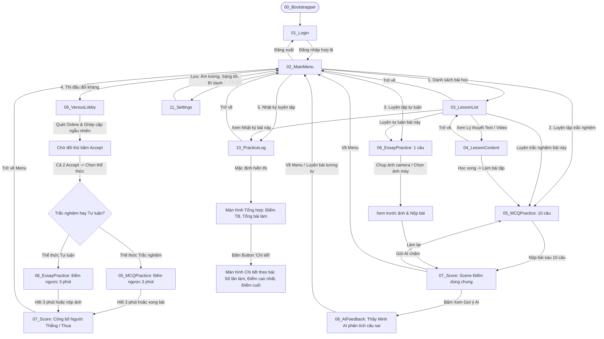

# KẾ HOẠCH TỔNG THỂ & BẢN THIẾT KẾ KIẾN TRÚC: MATH6-AI-COMPANION
**Hệ Thống Game Học Toán Lớp 6 Tích Hợp Gia Sư AI Tương Tác & Đấu Đối Kháng**
*Dành cho nhóm 3 sinh viên | Thời gian thực hiện: 8–9 tuần | Nền tảng: Unity (C#) + Google Sheets + Gemini API*

---

## 1. ĐÁNH GIÁ PHẠM VI & QUẢN TRỊ RỦI RO (SCOPE & RISK MANAGEMENT)

Nhóm 3 sinh viên xây dựng dự án trong thời gian 8–9 tuần cần giải quyết triệt để các rủi ro kỹ thuật nhằm tránh tắc nghẽn phụ thuộc lẫn nhau:

```
+-----------------------------------------------------------------------------------------------+
|                                     MA TRẬN QUẢN TRỊ RỦI RO                                   |
+------------------------------+--------------+-----------------------+-------------------------+
| Điểm rủi ro                  | Mức độ       | Hậu quả tiềm ẩn       | Giải pháp chuẩn hóa     |
+------------------------------+--------------+-----------------------+-------------------------+
| 1. Dùng trực tiếp Sheets SDK | 🔴 RẤT CAO   | Xung đột IL2CPP/C#    | Google Apps Script      |
|    (Google.Apis.Sheets v4)   |              | lỗi WebGL, lộ Secret  | REST API Proxy (JSON)   |
| 2. Nhận diện chữ viết tay TL | 🔴 RẤT CAO   | OCR offline nặng máy, | Tải ảnh/Chụp ảnh gửi    |
|    (Toán 6, phân số, số mũ)  |              | tỷ lệ sai > 60%       | Gemini Vision + Keypad  |
| 3. Thế giới 3D vô tận        | 🟡 TRUNG BÌNH| M1 kiệt sức đồ họa,   | Kiến trúc 11 Scene      |
|    (Nhiều phòng học rộng)    |              | không kịp làm các UI  | chuyên biệt, tập trung  |
| 4. AI Gia sư mất kiểm soát   | 🔴 RẤT CAO   | AI nói thẳng đáp án   | JSON State Machine      |
|    (Nói luôn lời giải bài)   |              | khi học sinh bí       | phân tích theo Rubric   |
| 5. Đồng bộ Realtime PvP      | 🟡 TRUNG BÌNH| Phức tạp Socket/Photon| Sảnh quét online + ghép |
|    (Chế độ thi đấu đối kháng)|              | tốn kém chi phí R&D   | đôi REST + Timer 3 phút |
+------------------------------+--------------+-----------------------+-------------------------+
```

### Các Giải Pháp Kiến Trúc Then Chốt:
1. **Cổng giao tiếp dữ liệu Google Apps Script Web App**:
   * Không cài NuGet Google API cồng kềnh vào Unity.
   * Dựng Web App trung gian trên Google Apps Script, tiếp nhận `POST`/`GET` qua HTTPS. Unity chỉ sử dụng `UnityWebRequest` gửi/nhận JSON tiêu chuẩn.
2. **Xử lý nộp bài tự luận linh hoạt (Chụp ảnh / Chọn ảnh & Bàn phím ảo)**:
   * Cho phép học sinh giải ra vở nháp, sử dụng **Nút Chụp ảnh trực tiếp từ Camera** hoặc **Nút Chọn ảnh từ thư viện thiết bị**.
   * Ảnh nộp bài được mã hóa Base64 hoặc upload Drive gửi sang Gemini 1.5/2.0 Flash để nhận diện và chấm điểm theo Rubric từng bước.
   * Cung cấp thêm Bàn phím ảo toán học (Virtual Math Keypad) dự phòng gõ công thức trực tiếp.
3. **Kiến trúc 11 Scene chuẩn hóa**:
   * Phân tách mạch lạc từng trách nhiệm của màn hình: từ Đăng nhập, Menu chính, Học lý thuyết, Luyện tập trắc nghiệm/tự luận đến Đối kháng và Nhật ký.
   * Tái sử dụng **Scene Điểm (`07_Score`)** và **Scene AI Gợi ý (`08_AIFeedback`)** làm màn hình dùng chung (Shared Scenes) cho tất cả các chế độ luyện tập và thi đấu.
4. **Cơ chế Thi đấu đối kháng 3 phút (Versus Battle)**:
   * Quét danh sách tài khoản đang đăng nhập trong cơ sở dữ liệu.
   * Ghép cặp ngẫu nhiên -> Cả 2 bên nhận thông báo Chấp nhận (Accept) -> Lựa chọn thể thức (Trắc nghiệm hoặc Tự luận) -> Đồng hồ đếm ngược 3 phút (03:00) bắt đầu -> Chuyển sang Scene Điểm công bố Người thắng cuộc (Winner).

---

## 2. ĐỊNH NGHĨA MVP TINH GỌN (REVISED MVP SPECIFICATION)

| Hạng mục | Trong phạm vi MVP (Tuần 1 – 8) | Mở rộng tùy chọn (Tuần 9+) |
| :--- | :--- | :--- |
| **Kiến trúc Scene** | 11 Scene hoàn chỉnh: Bootstrapper, Login, MainMenu, LessonList, LessonContent, MCQPractice, EssayPractice, Score, AIFeedback, VersusLobby, PracticeLog, Settings. | Phòng học 3D thế giới mở tương tác NPC. |
| **Chương trình học** | 2 Chuyên đề trọng tâm Toán 6 SGK mới: **Số nguyên** và **Phân số**. | Toàn bộ 8 chuyên đề hình học và số học SGK. |
| **Ngân hàng đề** | 30+ câu trắc nghiệm (MCQ) có giải thích chi tiết, 10+ bài toán tự luận nhiều bước có rubric chấm điểm. | 500+ câu hỏi tự động cào từ Internet. |
| **Luyện tập trắc nghiệm**| Mỗi lượt 10 câu ngẫu nhiên -> Hoàn thành sang Scene Điểm -> Sang Scene AI Gợi ý các câu sai. | Chế độ làm bài thi thử không giới hạn thời gian. |
| **Luyện tập tự luận** | Hiện ngẫu nhiên 1 câu tự luận -> Chụp ảnh từ Camera / Chọn ảnh từ thư viện -> Scene Điểm -> Scene AI Gợi ý. | Vẽ trực tiếp ngón tay lên màn hình cảm ứng. |
| **Thi đấu đối kháng** | Quét tài khoản online -> Ghép cặp ngẫu nhiên -> Đợi đối thủ Accept -> Chọn thể thức TN/TL -> Đếm ngược 3 phút -> Scene Điểm & Người thắng. | Ghép phòng thi đấu 4 người, bảng đấu giải đấu. |
| **Nhật ký luyện tập** | Mặc định hiển thị Tổng hợp -> Nút Chi tiết theo bài (Số lần làm, Điểm cao nhất, Điểm lần cuối). | Xuất báo cáo PDF gửi phụ huynh. |
| **Cài đặt hệ thống** | Chỉnh âm lượng (Master/BGM/SFX), Chỉnh sáng tối (Brightness/Theme), Đặt bí danh (Nickname/Avatar). | Đổi ngôn ngữ Tiếng Anh / Tiếng Việt. |

---

## 3. THIẾT KẾ CHI TIẾT TẤT CẢ CÁC SCENE (SCENE ARCHITECTURE)

Hệ thống được tổ chức thành **11 Scene độc lập** giúp quản lý tài nguyên hiệu quả, tránh xung đột Git giữa các thành viên:

```
Assets/_Project/Scenes/
├── 00_Bootstrapper.unity      # Khởi tạo hệ thống, Service Layer, Session, AudioManager
├── 01_Login.unity             # Đăng nhập tài khoản học sinh / giáo viên
├── 02_MainMenu.unity          # Màn hình chính (Hub điều hướng 6 tính năng)
├── 03_LessonList.unity        # Danh sách bài học, Điểm cao nhất & Người làm nhiều nhất
├── 04_LessonContent.unity     # Nội dung bài học (Tab Lý thuyết Text / Tab Video)
├── 05_MCQPractice.unity       # Luyện tập trắc nghiệm (10 câu ngẫu nhiên / 3 phút đối kháng)
├── 06_EssayPractice.unity     # Luyện tập tự luận (Chụp ảnh / Chọn ảnh thư viện / 3 phút đối kháng)
├── 07_Score.unity             # SCENE ĐIỂM DÙNG CHUNG (Trắc nghiệm, Tự luận, Thắng/Thua đối kháng)
├── 08_AIFeedback.unity        # SCENE AI GỢI Ý & PHÂN TÍCH LỖI SAI (Gia sư Thầy Minh)
├── 09_VersusLobby.unity       # Sảnh đối kháng (Quét online, ghép cặp ngẫu nhiên, Accept, chọn thể thức)
├── 10_PracticeLog.unity       # Nhật ký luyện tập (Chế độ Tổng hợp & Chi tiết theo bài)
└── 11_Settings.unity          # Cài đặt (Âm lượng, Sáng tối, Đặt bí danh)
```

### Bảng Chi Tiết Tính Năng & Thành Phần Của Từng Scene

| Mã Scene | Tên Scene | Mô tả chi tiết giao diện | Thành phần UI & Controller C# |
| :--- | :--- | :--- | :--- |
| **SC_00** | `00_Bootstrapper` | Khởi tạo hệ thống: Đọc cấu hình `AppConfig.json`, kiểm tra Internet, nạp các Singleton `DontDestroyOnLoad` (`GameManager`, `NetworkService`, `AudioManager`, `SessionManager`). Chuyển ngay sang `01_Login`. | - Background splash screen<br>- Thanh tải (Loading bar)<br>- `AppBootstrapper.cs`, `GameManager.cs` |
| **SC_01** | `01_Login` | Màn hình đăng nhập tài khoản học sinh hoặc giáo viên. Hỗ trợ ghi nhớ thông tin đăng nhập vào `PlayerPrefs`, băm mật khẩu SHA-256 trước khi gửi qua API. | - InputField Tên đăng nhập<br>- InputField Mật khẩu (ẩn ký tự)<br>- Nút `Đăng nhập`<br>- Text thông báo lỗi (đỏ)<br>- `LoginUIController.cs` |
| **SC_02** | `02_MainMenu` | Trung tâm điều hướng chính. Hiển thị thông tin học sinh (Avatar, Bí danh, Lớp). Cung cấp 6 nút truy cập chức năng chính và nút Đăng xuất. | - Card thông tin cá nhân (Bí danh, Huy hiệu đại diện)<br>- 6 nút chức năng chính: *1. Danh sách bài học*, *2. Luyện tập trắc nghiệm*, *3. Luyện tập tự luận*, *4. Thi đấu đối kháng*, *5. Nhật ký luyện tập*, *6. Cài đặt*<br>- Nút `Đăng xuất`<br>- `MainMenuUIController.cs` |
| **SC_03** | `03_LessonList` | Danh sách bài học theo chuyên đề (Số nguyên, Phân số). Từng bài hiển thị huy hiệu thống kê: **Điểm cao nhất** và **Người làm nhiều lần nhất**. Bấm vào bài mở Action Sheet lựa chọn hình thức học. | - ScrollView danh sách các bài học Toán 6<br>- Huy hiệu: `Điểm cao nhất: 10`, `Chăm chỉ nhất: student_an (15 lần)`<br>- Action Popup: `[Xem Text]`, `[Xem Video]`, `[Luyện trắc nghiệm]`, `[Luyện tự luận]`, `[Nhật ký bài]`<br>- Nút `Quay lại Menu`<br>- `LessonListUIController.cs` |
| **SC_04** | `04_LessonContent`| Hiển thị chi tiết lý thuyết của bài học được chọn. Thiết kế dạng 2 Tab chuyển đổi linh hoạt: **Tab 1: Lý thuyết Text & Công thức tóm tắt**; **Tab 2: Video bài giảng minh họa**. | - Tab Bar: `[Lý thuyết]` / `[Video]`<br>- RichText ScrollView hiển thị định dạng công thức Toán<br>- Unity VideoPlayer / WebView tích hợp phát video bài giảng<br>- Nút tắt chuyển thẳng sang Luyện tập TN / TL bài này<br>- Nút `Quay lại Danh sách`<br>- `LessonContentUIController.cs` |
| **SC_05** | `05_MCQPractice` | Chế độ làm bài trắc nghiệm. Mỗi lượt khởi tạo gồm **10 câu hỏi ngẫu nhiên**. Hiển thị câu hỏi, 4 nút đáp án A/B/C/D, tiến trình 1/10..10/10, đồng hồ đếm giờ. *(Tái sử dụng cho chế độ Đối kháng với cờ `isVersusMode` kích hoạt đếm ngược 3:00)*. | - Thẻ Question Card<br>- 4 nút Option A, B, C, D có hiệu ứng highlight<br>- Thanh tiến trình (ProgressBar 1/10)<br>- Text đồng hồ bấm giờ (hoặc đếm ngược 3 phút đối kháng)<br>- Nút `Nộp bài sớm`<br>- `MCQPracticeUIController.cs` |
| **SC_06** | `06_EssayPractice`| Chế độ luyện tập tự luận. Hệ thống bốc ngẫu nhiên **1 câu hỏi tự luận**. Học sinh làm bài ra nháp và nộp bài bằng 2 hình thức: **(1) Chụp ảnh từ Camera**, **(2) Chọn ảnh từ thư viện**. Có khung Preview xem trước ảnh trước khi bấm Gửi bài giải. *(Hỗ trợ cờ `isVersusMode` đếm ngược 3:00)*. | - Card đề bài tự luận ngẫu nhiên<br>- Nút `[Chụp ảnh bài làm]`<br>- Nút `[Chọn ảnh từ máy]`<br>- Khung Image Preview hiển thị ảnh bài làm đã chụp/chọn<br>- Nút `[Nộp bài giải]`<br>- Tùy chọn mở Bàn phím ảo toán học nhập văn bản bổ sung<br>- `EssayPracticeUIController.cs` |
| **SC_07** | `07_Score` | **SCENE ĐIỂM DÙNG CHUNG**: Tiếp nhận kết quả từ cả Trắc nghiệm, Tự luận và Đối kháng. Hiển thị điểm số đạt được, tổng điểm, thời gian hoàn thành, huy hiệu mới mở khóa (nếu có), và công bố Người Thắng / Thua (đối kháng). | - Vòng tròn điểm số hoạt họa (Circle Score Fill)<br>- Chi tiết: Số câu đúng/sai, Thời gian hoàn thành<br>- Banner Đối kháng: `CHIẾN THẮNG (WINNER)` / `THẤT BẠI (DEFEAT)` / `HÒA (DRAW)`<br>- Nút `[Gợi ý câu sai bằng AI]`<br>- Nút `[Làm lại]`<br>- Nút `[Về Menu chính]`<br>- `ScoreUIController.cs` |
| **SC_08** | `08_AIFeedback` | **SCENE AI GỢI Ý & PHÂN TÍCH LỖI SAI**: Gia sư AI ("Thầy Minh") phân tích chi tiết: Đối với trắc nghiệm, chỉ ra từng câu sai, đáp án đúng, phân tích vì sao sai và đưa ra bài tập tương tự. Đối với tự luận, phân tích các bước trong ảnh bài làm theo Rubric và gợi ý sửa lỗi. | - Avatar Thầy Minh (AI Companion)<br>- Danh sách thẻ các câu làm sai có thể chọn xem chi tiết<br>- Lời thoại giải thích sư phạm & Quy tắc cần nhớ<br>- Bài toán tương tự rèn luyện lại ngay<br>- Nút `[Về Menu]` / `[Tiếp tục luyện tập]`<br>- `AIFeedbackUIController.cs` |
| **SC_09** | `09_VersusLobby` | **SẢNH THI ĐẤU ĐỐI KHÁNG (PvP)**: Quét danh sách các tài khoản đang đăng nhập / online. Bấm tìm trận để ghép cặp ngẫu nhiên. Hiện popup chờ đối thủ Accept. Khi cả 2 đồng ý -> Chọn thể thức (Trắc nghiệm / Tự luận) -> Vào thi đấu với đồng hồ đếm ngược 3 phút. | - Bảng danh sách tài khoản online đang tìm trận<br>- Nút `[Ghép cặp ngẫu nhiên]`<br>- Modal "Đã tìm thấy đối thủ [Bí danh] - Accept / Decline"<br>- Modal "Chọn thể thức: Trắc nghiệm hay Tự luận"<br>- `VersusLobbyUIController.cs` |
| **SC_10** | `10_PracticeLog` | **NHẬT KÝ LUYỆN TẬP**: Gồm 2 chế độ hiển thị: **(1) Chế độ Tổng hợp** (mặc định mở đầu): Tổng bài đã làm, Điểm TB, Tỷ lệ hoàn thành, Tổng thời gian; **(2) Chế độ Chi tiết theo bài** (khi bấm Button "Chi tiết"): Chọn từng bài học để xem: Số lần làm, Điểm cao nhất, Điểm lần cuối cùng. | - Nút Toggle chuyển đổi: `[Tổng hợp]` / `[Chi tiết theo bài]`<br>- Dashboard Tổng hợp (Điểm TB, Tổng bài làm, Huy hiệu)<br>- Panel Chi tiết: Dropdown chọn bài học, hiển thị 3 thông số: Số lần làm, Điểm cao nhất, Điểm lần cuối cùng<br>- Nút `Quay lại Menu`<br>- `PracticeLogUIController.cs` |
| **SC_11** | `11_Settings` | **CÀI ĐẶT HỆ THỐNG**: Tùy chỉnh trải nghiệm học tập: Chỉnh âm lượng (Âm lượng tổng, BGM, SFX), Chỉnh sáng tối (Độ sáng Brightness / Chế độ Sáng - Tối bảo vệ mắt), Đặt bí danh (Nickname) hiển thị khi thi đấu. | - Slider Âm lượng Tổng, Nhạc nền (BGM), Hiệu ứng (SFX)<br>- Slider Brightness & Toggle Giao diện Sáng/Tối<br>- InputField Đặt bí danh (Nickname)<br>- Nút `[Lưu cài đặt]` (Lưu vào `PlayerPrefs`)<br>- Nút `[Quay lại Menu]`<br>- `SettingsUIController.cs` |

---

## 4. THIẾT KẾ LUỒNG TƯƠNG TÁC GIỮA CÁC SCENE (INTERACTION STATE FLOW)

### 4.1 Sơ Đồ Điều Hướng Tổng Thể (Mermaid Flowchart)


```mermaid
flowchart TD
    SC00([00_Bootstrapper]) --> SC01[01_Login]
    SC01 -->|Đăng nhập hợp lệ| SC02[02_MainMenu]
    SC02 -->|Đăng xuất| SC01

    %% 6 Menu Routes
    SC02 -->|1. Danh sách bài học| SC03[03_LessonList]
    SC02 -->|2. Luyện tập trắc nghiệm| SC05[05_MCQPractice: 10 câu]
    SC02 -->|3. Luyện tập tự luận| SC06[06_EssayPractice: 1 câu]
    SC02 -->|4. Thi đấu đối kháng| SC09[09_VersusLobby]
    SC02 -->|5. Nhật ký luyện tập| SC10[10_PracticeLog]
    SC02 -->|6. Cài đặt| SC11[11_Settings]

    %% Lesson List Sub-routes
    SC03 -->|Xem Lý thuyết Text / Video| SC04[04_LessonContent]
    SC03 -->|Luyện trắc nghiệm bài này| SC05
    SC03 -->|Luyện tự luận bài này| SC06
    SC03 -->|Xem Nhật ký bài này| SC10
    SC03 -->|Trở về| SC02
    SC04 -->|Học xong -> Làm bài tập| SC05
    SC04 -->|Trở về| SC03

    %% MCQ Practice Flow
    SC05 -->|Nộp bài sau 10 câu| SC07[07_Score: Scene Điểm dùng chung]

    %% Essay Practice Flow
    SC06 -->|Chụp ảnh camera / Chọn ảnh máy| SC06_PREV[Xem trước ảnh & Nộp bài]
    SC06_PREV -->|Gửi AI chấm| SC07

    %% Shared Score & AI Feedback Flow
    SC07 -->|Bấm Xem Gợi ý AI| SC08[08_AIFeedback: Thầy Minh AI phân tích câu sai]
    SC07 -->|Làm lại| SC05
    SC07 -->|Về Menu| SC02
    SC08 -->|Về Menu / Luyện bài tương tự| SC02

    %% Versus Flow
    SC09 -->|Quét Online & Ghép cặp ngẫu nhiên| SC09_WAIT[Chờ đối thủ bấm Accept]
    SC09_WAIT -->|Cả 2 Accept -> Chọn thể thức| SC09_CHOICE{Trắc nghiệm hay Tự luận?}
    SC09_CHOICE -->|Thể thức Trắc nghiệm| SC05_VS[05_MCQPractice: Đếm ngược 3 phút]
    SC09_CHOICE -->|Thể thức Tự luận| SC06_VS[06_EssayPractice: Đếm ngược 3 phút]
    SC05_VS -->|Hết 3 phút hoặc xong bài| SC07_VS[07_Score: Công bố Người Thắng / Thua]
    SC06_VS -->|Hết 3 phút hoặc nộp ảnh| SC07_VS
    SC07_VS -->|Trở về Menu| SC02

    %% Practice Log Flow
    SC10 -->|Mặc định hiển thị| SC10_SUM[Màn hình Tổng hợp: Điểm TB, Tổng bài làm]
    SC10_SUM -->|Bấm Button 'Chi tiết'| SC10_DET[Màn hình Chi tiết theo bài: Số lần làm, Điểm cao nhất, Điểm cuối]
    SC10 -->|Trở về| SC02

    %% Settings Flow
    SC11 -->|Lưu: Âm lượng, Sáng tối, Bí danh| SC02
```

---

### 4.2 Chi Tiết Các Kịch Bản Tương Tác Nghiệp Vụ

#### A. Luồng Danh Sách Bài Học (`03_LessonList` & `04_LessonContent`)
1. Từ **Main Menu**, chọn **Danh sách bài học**.
2. Hệ thống tải danh mục bài học từ Google Sheets (hoặc cache). Mỗi item trên danh sách hiển thị rõ ràng:
   * Tên bài học (ví dụ: *Bài 2: Phép nhân và phép chia hai số nguyên*).
   * **Điểm cao nhất** của chính học sinh tại bài này.
   * **Người làm nhiều lần nhất**: Vinh danh bạn học chăm chỉ nhất lớp (ví dụ: *Bạn An: 12 lần*).
3. Khi học sinh nhấp vào một bài học, hệ thống hiện Action Sheet gồm các lựa chọn:
   * `[Nội dung Text]`: Chuyển sang `04_LessonContent` mở Tab Lý thuyết & công thức tóm tắt.
   * `[Nội dung Video]`: Chuyển sang `04_LessonContent` mở Tab Video bài giảng minh họa.
   * `[Luyện tập Trắc nghiệm]`: Khởi chạy `05_MCQPractice` nạp riêng bộ câu hỏi thuộc bài học này.
   * `[Luyện tập Tự luận]`: Khởi chạy `06_EssayPractice` bốc câu tự luận thuộc bài học này.
   * `[Nhật ký bài học]`: Chuyển sang `10_PracticeLog` mở thẳng phần chi tiết bài này.

#### B. Luồng Luyện Tập Trắc Nghiệm (`05_MCQPractice` -> `07_Score` -> `08_AIFeedback`)
1. Bắt đầu luyện tập: Hệ thống xáo trộn ngẫu nhiên và chọn ra **10 câu trắc nghiệm**.
2. Học sinh thao tác chọn đáp án (A, B, C, D) cho từng câu. Màn hình hiển thị số thứ tự câu `Câu X/10` và đồng hồ tính giờ.
3. Sau câu thứ 10 (hoặc khi bấm Nộp bài), hệ thống tự động lưu kết quả vào Google Sheets và chuyển sang **`07_Score` (Scene Điểm dùng chung)**:
   * Vòng tròn điểm số hiển thị kết quả (ví dụ: `8/10`).
   * Bảng tóm tắt: Thời gian hoàn thành, số câu đúng, số câu sai.
   * Nếu có câu sai, nút **`[Gợi ý các câu sai bằng AI]`** sẽ phát sáng nổi bật.
4. Bấm **`[Gợi ý các câu sai bằng AI]`** -> Chuyển sang **`08_AIFeedback`**:
   * AI Companion ("Thầy Minh") hiển thị danh sách các câu làm sai.
   * Khi chọn một câu sai: AI chỉ ra điểm học sinh nhầm lẫn (ví dụ: *Em đã quên đổi dấu khi chuyển vế*), nhắc lại công thức đúng và đưa ra 1 câu hỏi tương tự để kiểm tra độ hiểu bài ngay tại chỗ.

#### C. Luồng Luyện Tập Tự Luận (`06_EssayPractice` -> `07_Score` -> `08_AIFeedback`)
1. Bắt đầu luyện tập tự luận: Hệ thống bốc ngẫu nhiên **1 câu hỏi tự luận** từ ngân hàng câu hỏi.
2. Học sinh lấy giấy nháp ra giải bài toán. Khi hoàn thành, học sinh chọn 1 trong 2 nút trên giao diện:
   * **Nút 1: Chụp ảnh trực tiếp**: Kích hoạt Camera của máy để chụp ảnh bài làm.
   * **Nút 2: Chọn ảnh từ thư viện**: Mở cửa sổ chọn file ảnh bài làm có sẵn trên máy.
3. Ảnh sau khi chụp/chọn được hiển thị trên khung **Image Preview** để học sinh kiểm tra độ nét. Nếu bị mờ có thể bấm "Chụp lại".
4. Học sinh bấm **`[Nộp bài giải]`**:
   * Client gửi ảnh sang Gemini Vision API phân tích theo Rubric từng bước.
   * Chuyển sang **`07_Score` (Scene Điểm dùng chung)**: Hiển thị điểm số tự luận đạt được (ví dụ: `8.5/10`).
5. Bấm **`[Xem Gợi ý AI]`** -> Chuyển sang **`08_AIFeedback`**:
   * AI Thầy Minh nhận xét chi tiết: Bước 1 tính đúng (+3đ), Bước 2 sai thứ tự (-2đ), kèm lời khuyên phương pháp tính nhanh.

#### D. Luồng Thi Đấu Đối Kháng (`09_VersusLobby` -> `05`/`06` có đếm ngược 3 phút -> `07_Score`)
1. Học sinh vào sảnh **`09_VersusLobby`**:
   * Hệ thống gọi API quét danh sách các tài khoản đang trực tuyến/đăng nhập.
2. Học sinh bấm **`[Ghép cặp ngẫu nhiên]`**:
   * Hệ thống tìm đối thủ ngẫu nhiên trong danh sách online.
   * Màn hình của cả 2 học sinh hiện Modal: *"Đã tìm thấy đối thủ [Bí danh đối thủ]. Bạn có chấp nhận thi đấu?"* kèm nút **Accept (Chấp nhận)** và **Decline (Từ chối)**.
3. Khi cả 2 học sinh cùng bấm **Accept**:
   * Mở cửa sổ lựa chọn thể thức thi đấu: **Trắc nghiệm** hoặc **Tự luận**.
4. Sau khi chọn thể thức:
   * Chuyển vào Scene thi đấu tương ứng (`05_MCQPractice` hoặc `06_EssayPractice`).
   * Kích hoạt **Đồng hồ đếm ngược 3 phút (03:00)** hiển thị màu đỏ nhấp nháy trên đỉnh màn hình.
   * Hiển thị thanh tiến trình 2 bên: Học sinh và Đối thủ.
5. Khi hết 3 phút hoặc cả hai bên đã nộp bài xong:
   * Tự động chuyển ngay sang **`07_Score` (Scene Điểm dùng chung)**.
   * So sánh điểm số và thời gian làm bài của 2 người chơi.
   * Kích hoạt hiệu ứng âm thanh và Banner vinh danh: **`CHIẾN THẮNG (WINNER)`**, **`THẤT BẠI (DEFEAT)`** hoặc **`HÒA (DRAW)`**.

#### E. Luồng Nhật Ký Luyện Tập (`10_PracticeLog`)
1. Học sinh truy cập **Nhật ký luyện tập**:
   * **Màn hình mặc định: Chế độ Tổng hợp (Summary View)**:
     * Tổng số bài đã hoàn thành.
     * Điểm trung bình toàn khóa.
     * Tổng thời gian rèn luyện.
     * Bộ sưu tập huy hiệu đạt được.
2. Học sinh bấm nút **`[Chi tiết theo bài]`**:
   * Chuyển sang **Chế độ Chi tiết theo bài (By-Lesson View)**:
   * Cung cấp dropdown danh sách các bài học. Khi chọn một bài học cụ thể, bảng thông tin hiển thị chính xác 3 chỉ số trọng tâm:
     1. **Số lần làm bài** (Total Attempts).
     2. **Điểm cao nhất** (Highest Score).
     3. **Điểm lần cuối cùng** (Last Attempt Score).

#### F. Luồng Cài Đặt Hệ Thống (`11_Settings`)
1. Học sinh mở màn hình Cài đặt:
   * **Âm lượng**: Kéo thanh Slider chỉnh Âm lượng Tổng (Master), Nhạc nền (BGM), Âm thanh tương tác (SFX) -> Cập nhật trực tiếp `AudioManager`.
   * **Sáng tối**: Slider chỉnh độ sáng màn hình (Brightness) và Toggle chuyển đổi Chế độ Sáng / Tối (Light / Dark Theme) bảo vệ thị lực.
   * **Đặt bí danh**: Nhập tên Bí danh (Nickname) đại diện -> Bấm Lưu sẽ cập nhật vào `PlayerPrefs` và đồng bộ lên Google Sheets.

---

### 4.3 Ma Trận Chuyển Scene & Dữ Liệu Kèm Theo (Scene State Transition Matrix)

| Scene nguồn | Hành động / Sự kiện | Scene đích | Dữ liệu truyền kèm (State/Payload) |
| :--- | :--- | :--- | :--- |
| `00_Bootstrapper` | Khởi tạo xong Services | `01_Login` | Không |
| `01_Login` | Xác thực đăng nhập thành công | `02_MainMenu` | `UserData` (userId, fullName, role, nickname) |
| `02_MainMenu` | Bấm "Danh sách bài học" | `03_LessonList` | `userProgressList` |
| `02_MainMenu` | Bấm "Luyện tập trắc nghiệm" | `05_MCQPractice` | `mode = SOLO_PRACTICE, questionCount = 10` |
| `02_MainMenu` | Bấm "Luyện tập tự luận" | `06_EssayPractice` | `mode = SOLO_PRACTICE, randomQuestion = true` |
| `02_MainMenu` | Bấm "Thi đấu đối kháng" | `09_VersusLobby` | `currentUserId, nickname` |
| `02_MainMenu` | Bấm "Nhật ký luyện tập" | `10_PracticeLog` | `view = SUMMARY_DEFAULT` |
| `02_MainMenu` | Bấm "Cài đặt" | `11_Settings` | `currentAudioSettings, currentBrightness, nickname` |
| `03_LessonList` | Chọn "Nội dung Text/Video" | `04_LessonContent` | `selectedLessonId, initialTab = TEXT/VIDEO` |
| `03_LessonList` | Chọn "Luyện trắc nghiệm bài này"| `05_MCQPractice` | `lessonId = selectedLessonId, count = 10` |
| `03_LessonList` | Chọn "Luyện tự luận bài này" | `06_EssayPractice` | `lessonId = selectedLessonId` |
| `03_LessonList` | Chọn "Nhật ký bài này" | `10_PracticeLog` | `view = DETAIL, targetLessonId = selectedLessonId` |
| `05_MCQPractice` | Nộp bài sau 10 câu (hoặc đối kháng)| `07_Score` | `QuizResult` (score, maxScore, timeSpent, wrongQuestions, versusState) |
| `06_EssayPractice`| Nộp bài chụp/chọn ảnh | `07_Score` | `EssayResult` (score, maxScore, rubricAnalysis, imageRef) |
| `07_Score` | Bấm "Gợi ý câu sai bằng AI" | `08_AIFeedback` | `FeedbackContext` (wrongQuestions / essayRubricAnalysis) |
| `07_Score` | Bấm "Làm lại" | `05_MCQPractice` hoặc `06_EssayPractice` | `retryContext` |
| `07_Score` / `08_AIFeedback` | Bấm "Về Menu chính" | `02_MainMenu` | Không |
| `09_VersusLobby` | Cả 2 Accept & Chọn Trắc nghiệm | `05_MCQPractice` | `mode = VERSUS_BATTLE, timer = 180s, opponentData` |
| `09_VersusLobby` | Cả 2 Accept & Chọn Tự luận | `06_EssayPractice` | `mode = VERSUS_BATTLE, timer = 180s, opponentData` |

---

## 5. HỢP ĐỒNG DỮ LIỆU ĐÓNG BĂNG (DATA & INTERFACE CONTRACTS)

Toàn bộ các yêu cầu truyền thông mạng giữa Unity và Google Apps Script / Gemini API được đặc tả đóng băng dưới dạng JSON:

### 5.1 Hợp Đồng Đăng Nhập & Hồ Sơ (`action=login`)
* **Request (Unity -> Apps Script)**:
```json
{
  "action": "login",
  "username": "student_an",
  "passwordHash": "a665a45920422f9d417e4867efdc4fb8a04a1f3fff1fa07e998e86f7f7a27ae3"
}
```
* **Response**:
```json
{
  "success": true,
  "data": {
    "userId": "STU_001",
    "username": "student_an",
    "fullName": "Nguyễn Văn An",
    "nickname": "AnThầnĐồng",
    "role": "STUDENT",
    "grade": 6,
    "classId": "6A1"
  }
}
```

### 5.2 Hợp Đồng Danh Sách Bài Học & Vinh Danh (`action=getLessons`)
* **Response**:
```json
{
  "success": true,
  "lessons": [
    {
      "lessonId": "LES_INT_01",
      "topic": "Integers",
      "title": "Phép cộng và phép trừ hai số nguyên",
      "grade": 6,
      "summaryText": "Quy tắc cộng hai số cùng dấu, khác dấu...",
      "videoUrl": "https://video.math6.edu.vn/integers_add.mp4",
      "userHighestScore": 10,
      "topStudent": {
        "nickname": "BìnhToánHọc",
        "attemptsCount": 16
      }
    }
  ]
}
```

### 5.3 Hợp Đồng Sảnh Đối Kháng & Ghép Cặp (`action=matchmaking`)
* **Quét người dùng online (`action=getOnlineUsers`)**:
```json
{
  "success": true,
  "onlineUsers": [
    {"userId": "STU_002", "nickname": "BảoToánHọc", "status": "LOOKING_FOR_MATCH"},
    {"userId": "STU_005", "nickname": "ChiHọcGiỏi", "status": "IN_MATCH"}
  ]
}
```
* **Ghép cặp & Gửi lời mời thi đấu (`action=inviteMatch`)**:
```json
{
  "action": "inviteMatch",
  "fromUserId": "STU_001",
  "toUserId": "STU_002"
}
```
* **Phản hồi Accept & Chọn thể thức (`action=acceptMatch`)**:
```json
{
  "action": "acceptMatch",
  "matchId": "VS_20260919_01",
  "mode": "MCQ",
  "durationSeconds": 180,
  "questionSeed": 1082
}
```

### 5.4 Hợp Đồng Chấm Tự Luận Qua Ảnh (Gemini Vision API)
* **Request gửi Gemini Vision**:
  - `prompt`: "Bạn là giám khảo chấm bài tự luận Toán 6 theo Rubric. Hãy phân tích ảnh bài làm, phát hiện các bước tính, cho điểm và chỉ ra lỗi sai."
  - `image`: Base64 chuỗi ảnh chụp từ camera hoặc chọn từ máy.
  - `questionPrompt`: "Tính giá trị biểu thức: $15 - (3 + 2) \cdot 2$".
* **Structured JSON Response từ AI**:
```json
{
  "score": 8.0,
  "maxScore": 10.0,
  "passed": true,
  "detectedMistakeType": "NONE",
  "stepAnalysis": [
    {"step": 1, "isCorrect": true, "comment": "Học sinh tính đúng trong ngoặc: 3 + 2 = 5"},
    {"step": 2, "isCorrect": true, "comment": "Học sinh thực hiện phép nhân trước: 5 * 2 = 10"},
    {"step": 3, "isCorrect": true, "comment": "Phép trừ cuối cùng: 15 - 10 = 5"}
  ],
  "pedagogicalFeedback": "Lời giải trình bày sạch sẽ, chuẩn thứ tự phép tính!",
  "remedialExercise": ""
}
```

### 5.5 Hợp Đồng Nhật Ký Luyện Tập (Summary & By-Lesson)
* **API Lấy Tổng Hợp (`action=getPracticeLogSummary`)**:
```json
{
  "success": true,
  "userId": "STU_001",
  "summary": {
    "totalCompletedLessons": 12,
    "totalAttempts": 48,
    "averageScore": 8.6,
    "totalTimeSpentMinutes": 215,
    "mcqAccuracyRate": 0.88,
    "essayPassRate": 0.82
  }
}
```
* **API Lấy Chi Tiết Theo Bài (`action=getPracticeLogByLesson&lessonId=LES_INT_01`)**:
```json
{
  "success": true,
  "lessonId": "LES_INT_01",
  "lessonTitle": "Phép cộng và phép trừ hai số nguyên",
  "detail": {
    "totalAttempts": 9,
    "highestScore": 10,
    "lastAttemptScore": 9,
    "lastAttemptDate": "2026-09-18T15:30:00Z"
  }
}
```

### 5.6 Hợp Đồng Cài Đặt & Cập Nhật Bí Danh (`action=updateProfile`)
* **Request**:
```json
{
  "action": "updateProfile",
  "userId": "STU_001",
  "nickname": "AnToánThủ",
  "themePreference": "DARK",
  "masterVolume": 0.8
}
```

---

## 6. CƠ SỞ DỮ LIỆU GOOGLE SHEETS (DATABASE SCHEMA)

Cơ sở dữ liệu được tổ chức thành **9 bảng (Sheet Tabs)** chuẩn hóa:

```
+-----------------------------------------------------------------------------------------------------+
|                                      GOOGLE SHEETS SCHEMA                                           |
+-------------------+---------------------------------------------------------------------------------+
| Tên Bảng (Tab)    | Danh Sách Cột (Dòng 1 Header)                                                   |
+-------------------+---------------------------------------------------------------------------------+
| Users             | UserID | Username | PasswordHash | Role | FullName | Nickname | Grade | ClassID      |
| Lessons           | LessonID | Topic | Title | Grade | OrderIndex | SummaryText | VideoUrl              |
| Questions_Math6   | QuestionID | LessonID | Topic | Type | Difficulty | Prompt | OptA | OptB | OptC |  |
|                   | OptD | CorrectAnswer | RubricJSON | Explanation | Status (PUBLISHED)                |
| Results           | ResultID | UserID | LessonID | ActivityType | Score | MaxScore | TimeSpentSec |     |
|                   | MistakesCount | SubmittedAt                                                         |
| Progress          | ProgressID | UserID | LessonID | Attempts | HighestScore | LastScore | Completed | |
|                   | LastAttemptDate                                                                 |
| Online_Sessions   | SessionID | UserID | Nickname | LastHeartbeat | Status (ONLINE/MATCHING/IN_GAME)   |
| Badges            | BadgeID | BadgeCode | Name | Description | IconURL | ConditionType | Threshold    |
| StudentBadges     | UserBadgeID | UserID | BadgeID | UnlockedAt                                         |
| AI_Logs           | LogID | UserID | QuestionID | SubmissionTextOrImg | AIResponseJSON | Timestamp       |
+-------------------+---------------------------------------------------------------------------------+
```

---

## 7. AI ENGINE & PROMPT SƯ PHẠM TOÁN LỚP 6

### 7.1 Prompt AI Phân Tích Câu Sai Trắc Nghiệm Trong Scene `08_AIFeedback`
```markdown
SYSTEM PROMPT:
Bạn là "Thầy Minh" - Gia sư AI dạy Toán lớp 6 tâm lý, ân cần và chuẩn sư phạm Việt Nam.
Nhiệm vụ: Giải thích chi tiết các câu trắc nghiệm học sinh đã làm SAI trong bài thi vừa rồi.

ĐẦU VÀO:
- Câu hỏi Toán 6, 4 phương án A, B, C, D.
- Đáp án học sinh đã chọn (sai).
- Đáp án đúng của bài toán.

QUY TẮC PHẢN HỒI:
1. Động viên nhẹ nhàng, không phán xét.
2. Phân tích chính xác nguyên nhân học sinh chọn phương án sai (Ví dụ: "Em chọn -15 vì nhầm lẫn quy tắc cộng hai số khác dấu thành giữ dấu của số bé hơn...").
3. Nhắc lại quy tắc/công thức toán học cốt lõi ngắn gọn dễ nhớ.
4. Đưa ra 1 bài toán tương tự để học sinh thử tính lại ngay.
5. Định dạng trả về JSON hợp lệ:
{
  "questionId": "Q_INT_001",
  "diagnosis": "Phân tích nguyên nhân sai",
  "ruleReminder": "Quy tắc cốt lõi",
  "analogousProblem": "Bài toán tương tự để luyện lại",
  "analogousAnswer": "Đáp án bài tương tự"
}
```

### 7.2 Prompt AI Chấm Điểm Ảnh Tự Luận Theo Rubric (Gemini Vision)
```markdown
SYSTEM PROMPT:
Bạn là Giám khảo AI chấm thi tự luận Toán 6 theo Rubric chuẩn Bộ GD&ĐT Việt Nam từ ảnh chụp bài làm của học sinh.
Nhiệm vụ:
1. Nhận diện các dòng chữ viết tay trong ảnh.
2. Đối chiếu từng bước với Rubric điểm.
3. Chấm điểm từng bước, cộng dồn tổng điểm.
4. Phân loại lỗi toán học: Thứ tự phép tính, Nhầm dấu số nguyên, Cộng trừ phân số sai mẫu số.
5. Trả về định dạng JSON:
{
  "score": number,
  "maxScore": number,
  "passed": boolean,
  "detectedMistakeType": "ORDER_OF_OPERATIONS" | "SIGN_ERROR" | "FRACTION_DENOMINATOR" | "ARITHMETIC" | "NONE",
  "stepAnalysis": [
    {"step": number, "isCorrect": boolean, "comment": "string"}
  ],
  "pedagogicalFeedback": "string"
}
```

---

## 8. PHÂN CHIA NHIỆM VỤ CHO NHÓM 3 THÀNH VIÊN (TASK BREAKDOWN)

> Ký hiệu mức độ phụ thuộc:
> 🔵 **Độc lập (Independent)**: Làm ngay được với Mock Data.
> 🟡 **Cần Hợp đồng Giao diện (Interface Contract)**: Cần chốt khung JSON/C#.
> 🔴 **Cần Tích hợp (Integration)**: Cần ghép nối giữa các thành viên.

### Thành Viên 1: Gameplay & UI Lead (M1)
| Task ID | Tên công việc | Mức độ | Thời gian | Phụ thuộc | Đầu vào | Sản phẩm bàn giao |
| :--- | :--- | :--- | :--- | :--- | :--- | :--- |
| **U-01** | Tạo khung 11 Scene & Scene Navigator | 🔴 Cao | 3 ngày | Không | Mock Controller | Cấu trúc 11 file `.unity` trong `Assets/_Project/Scenes/` |
| **U-02** | UI Main Menu & Dashboard 6 nút | 🟡 TB | 2 ngày | U-01 | Design Spec | `02_MainMenu.unity` + `MainMenuUIController.cs` |
| **U-03** | UI Danh sách bài học & Nội dung Text/Video | 🔴 Cao | 3 ngày | U-01 | Contract 5.2 | `03_LessonList` & `04_LessonContent` + Tabs Controller |
| **U-04** | UI Trắc nghiệm 10 câu & Bộ đếm giờ | 🔴 Cao | 3 ngày | U-01 | MockQuestions | `05_MCQPractice.unity` + `MCQPracticeUIController.cs` |
| **U-05** | UI Tự luận: Nút Chụp ảnh & Chọn ảnh thư viện | 🔴 Cao | 3 ngày | U-01 | Native Plugin | `06_EssayPractice.unity` + Khung Image Preview |
| **U-06** | Scene Điểm dùng chung & Scene AI Gợi ý | 🔴 Cao | 3 ngày | U-04, U-05 | Mock Score | `07_Score.unity` & `08_AIFeedback.unity` |
| **U-07** | UI Sảnh đối kháng & Đếm ngược 3 phút | 🔴 Cao | 3 ngày | U-01 | Contract 5.3 | `09_VersusLobby.unity` + Timer 3:00 trên `05`/`06` |
| **U-08** | UI Nhật ký luyện tập (Tổng hợp & Chi tiết) | 🟡 TB | 2 ngày | U-01 | Contract 5.5 | `10_PracticeLog.unity` (Toggle 2 View) |
| **U-09** | UI Cài đặt: Âm lượng, Sáng tối, Đặt bí danh | 🟡 TB | 2 ngày | U-01 | Settings Spec | `11_Settings.unity` + `SettingsUIController.cs` |
| **U-10** | Tích hợp âm thanh, hiệu ứng & Đóng gói build | 🔴 Cao | 4 ngày | U-01..U-09 | Real APIs | Bản build Windows Standalone / WebGL hoàn chỉnh |

---

### Thành Viên 2: Google Sheets, Dữ Liệu & Backend Lead (M2)
| Task ID | Tên công việc | Mức độ | Thời gian | Phụ thuộc | Đầu vào | Sản phẩm bàn giao |
| :--- | :--- | :--- | :--- | :--- | :--- | :--- |
| **D-01** | Tạo 9 bảng Google Sheets cơ sở dữ liệu | 🔴 Cao | 2 ngày | Không | Schema mục 6 | Google Sheet với dữ liệu mẫu chuẩn |
| **D-02** | Google Apps Script Auth & Profile (Bí danh) | 🔴 Cao | 2 ngày | D-01 | Contract 5.1 | API `/login` và `/updateProfile` |
| **D-03** | API Danh sách bài học kèm Top chăm chỉ & MaxScore | 🔴 Cao | 2 ngày | D-01 | Contract 5.2 | API `/getLessons` |
| **D-04** | API Ngân hàng câu hỏi theo chuyên đề | 🔴 Cao | 2 ngày | D-01 | Dữ liệu câu hỏi | API `/getQuestions` (Lọc PUBLISHED) |
| **D-05** | API Lưu kết quả thi & Kích hoạt Huy hiệu | 🔴 Cao | 3 ngày | D-01 | Kết quả nộp | API `/saveResult` + Trigger mở khóa Badge |
| **D-06** | API Sảnh đối kháng (Quét online & Ghép cặp) | 🔴 Cao | 3 ngày | D-01 | Contract 5.3 | API `/getOnlineUsers`, `/inviteMatch`, `/acceptMatch` |
| **D-07** | API Nhật ký luyện tập (Tổng hợp & Chi tiết theo bài)| 🔴 Cao | 2 ngày | D-01 | Contract 5.5 | API `/getPracticeLogSummary` & `/getPracticeLogByLesson` |
| **D-08** | C# `GoogleSheetsClient.cs` kết nối mạng Unity | 🔴 Cao | 3 ngày | D-02..D-07 | `INetworkService` | `GoogleSheetsClient.cs` xử lý `UnityWebRequest` |
| **D-09** | Tối ưu hóa bộ nhớ đệm Offline Cache (`PlayerPrefs`) | 🟡 TB | 2 ngày | D-08 | Unity Client | Xử lý mạng chập chờn không mất dữ liệu điểm số |

---

### Thành Viên 3: AI Engine, Prompts & Sư Phạm Toán (M3)
| Task ID | Tên công việc | Mức độ | Thời gian | Phụ thuộc | Đầu vào | Sản phẩm bàn giao |
| :--- | :--- | :--- | :--- | :--- | :--- | :--- |
| **AI-01** | Thiết kế bộ System Prompt Toán 6 chuẩn sư phạm | 🔴 Cao | 3 ngày | Không | SGK Toán 6 | Tài liệu System Prompts chi tiết |
| **AI-02** | Prompt AI Phân tích câu sai Trắc nghiệm (Thầy Minh) | 🔴 Cao | 3 ngày | AI-01 | Prompt 7.1 | Prompt giải thích lỗi sai & sinh câu hỏi tương tự |
| **AI-03** | Prompt Gemini Vision chấm ảnh tự luận theo Rubric | 🔴 Cao | 3 ngày | AI-01 | Prompt 7.2 | Prompt nhận diện ảnh, chấm điểm từng bước |
| **AI-04** | C# `GeminiClient.cs` tích hợp API trong Unity | 🔴 Cao | 3 ngày | AI-02, AI-03 | REST API Key | `GeminiClient.cs` gửi nhận JSON với Gemini |
| **AI-05** | Bộ chuyển đổi Base64 ảnh bài làm từ Camera/Gallery | 🔴 Cao | 2 ngày | AI-04 | Texture2D | Module xử lý nén và mã hóa ảnh trước khi gửi AI |
| **AI-06** | Thẩm định ngân hàng 40 câu hỏi Toán 6 chính thức | 🔴 Cao | 2 ngày | D-01 | Ngân hàng đề | 30 câu MCQ + 10 câu Tự luận đưa lên Sheet chính |
| **AI-07** | Kiểm thử chịu tải và Benchmark độ chuẩn xác AI (>90%)| 🟡 TB | 2 ngày | AI-04, AI-05 | 20 bài test | Báo cáo đánh giá độ chính xác chấm điểm tự luận |

---

## 9. LỘ TRÌNH 9 TUẦN & CÁC CỘT MỐC ĐÁNH GIÁ (LAB CHECKPOINTS)

```
+------+--------------------------+------------------------------+--------------------------------------------+
| Tuần | M1 (Gameplay & Giao diện)| M2 (Dữ liệu & Sheets API)    | M3 (AI & Sư phạm Toán)                     |
+------+--------------------------+------------------------------+--------------------------------------------+
| T1   | U-01: Dựng 11 Scene cơ sở| D-01: Tạo 9 bảng Google Sheet| AI-01: Soạn Prompt Toán 6 chuẩn sư phạm    |
|      | U-02: Hoàn thiện MainMenu| Đóng băng Hợp đồng Dữ liệu   | Đóng băng Hợp đồng Gemini JSON             |
+------+--------------------------+------------------------------+--------------------------------------------+
| T2   | U-03: UI Danh sách bài   | D-02: API Đăng nhập & Profile| AI-02: Thử nghiệm Prompt Thầy Minh AI      |
|      | U-04: UI Trắc nghiệm 10 c| D-03: API Bài học & Top user | Soạn thảo 15 câu trắc nghiệm đầu tiên      |
+------+--------------------------+------------------------------+--------------------------------------------+
| T3   | U-05: Chụp & Chọn ảnh TL | D-04: API Lấy câu hỏi        | AI-03: Thử nghiệm Gemini Vision chấm ảnh   |
|      | U-06: Scene Điểm & AI    | D-05: API Lưu điểm & Badge   | AI-04: Viết `GeminiClient.cs`              |
+------+--------------------------+------------------------------+--------------------------------------------+
| T4   | [CỘT MỐC LAB 1]          | [CỘT MỐC LAB 1]              | [CỘT MỐC LAB 1]                            |
|      | Demo Luồng Menu -> TN -> | Demo Sheets API Đăng nhập &  | Demo AI chấm câu sai trắc nghiệm &         |
|      | Điểm -> Gợi ý AI câu sai | Trả danh sách câu hỏi chuẩn  | Nhận diện mẫu ảnh bài làm tự luận          |
+------+--------------------------+------------------------------+--------------------------------------------+
| T5   | U-07: Sảnh đối kháng     | D-06: API Sảnh đối kháng     | AI-05: Module mã hóa nén ảnh bài làm       |
|      | Bộ đếm ngược 3 phút      | Quét online & ghép cặp       | Nạp 10 bài toán tự luận kèm rubric         |
+------+--------------------------+------------------------------+--------------------------------------------+
| T6   | U-08: UI Nhật ký (2 View)| D-07: API Nhật ký luyện tập  | AI-06: Hoàn thiện 40 câu hỏi chính thức    |
|      | U-09: UI Cài đặt (3 mục) | Tối ưu truy vấn dữ liệu theo bài| Tinh chỉnh lời thoại giải thích của AI    |
+------+--------------------------+------------------------------+--------------------------------------------+
| T7   | Ghép nối toàn diện 11    | D-08: C# `GoogleSheetsClient`| AI-07: Benchmark độ chính xác chấm điểm    |
|      | Scene vào hệ thống chung | Tích hợp mạng vào Unity      | Thử nghiệm các ca ảnh mờ/nghiêng           |
+------+--------------------------+------------------------------+--------------------------------------------+
| T8   | [CỘT MỐC LAB 2]          | [CỘT MỐC LAB 2]              | [CỘT MỐC LAB 2]                            |
|      | Demo Luồng Đối Kháng 3p  | Demo Ghi điểm & Cập nhật     | Demo Chụp ảnh bài làm -> Chấm điểm ->      |
|      | Demo Nhật ký tổng hợp/bài| Tiến độ real-time lên Sheet  | Thầy Minh AI phân tích từng bước           |
+------+--------------------------+------------------------------+--------------------------------------------+
| T9   | U-10: Âm thanh, hiệu ứng | D-09: Kiểm thử offline cache | Tối ưu độ trễ gọi AI (<1.5s)               |
|      | Đóng gói bản build Final | Sao lưu cơ sở dữ liệu        | Chuẩn bị slide & Kịch bản demo 5 phút      |
+------+--------------------------+------------------------------+--------------------------------------------+
```

---

## 10. KỊCH BẢN DEMO TỔNG KẾT (5 PHÚT TỎA SÁNG)

```
+----------------------------------------------------------------------------------------------------+
|                                      KỊCH BẢN BÁO CÁO CUỐI KỲ (5 PHÚT)                             |
+-------------------+--------------------------------------------------------------------------------+
| Thời gian         | Thao tác trên màn hình & Nội dung thuyết minh                                  |
+-------------------+--------------------------------------------------------------------------------+
| **0:00 - 0:40**   | **SCENE 1: ĐĂNG NHẬP & MAIN MENU**                                             |
|                   | - Học sinh "AnThầnĐồng" đăng nhập.                                             |
|                   | - Main Menu hiện ra với giao diện hiện đại, hiển thị bí danh và 6 nút chức năng.|
|                   | - Mở nhanh **Setting**: Trình diễn kéo slider âm lượng và bật Dark Mode.       |
+-------------------+--------------------------------------------------------------------------------+
| **0:40 - 1:45**   | **SCENE 2: DANH SÁCH BÀI HỌC & LUYỆN TẬP TRẮC NGHIỆM**                         |
|                   | - Vào "Danh sách bài học": Xem bài "Phép cộng số nguyên", thấy bạn Bình đang   |
|                   |   dẫn đầu với 16 lần làm bài.                                                  |
|                   | - Bấm làm trắc nghiệm: Hoàn thành nhanh 10 câu. Cố ý chọn sai 1 câu quy tắc dấu.|
|                   | - Chuyển sang **Scene Điểm dùng chung**: Đạt 9/10 điểm, thời gian 45 giây.     |
|                   | - Bấm **[Xem gợi ý câu sai bằng AI]**: Scene Thầy Minh AI mở ra, phân tích     |
|                   |   đúng nguyên nhân vì sao chọn sai câu đó và nhắc lại quy tắc cộng số nguyên.  |
+-------------------+--------------------------------------------------------------------------------+
| **1:45 - 2:50**   | **SCENE 3: LUYỆN TẬP TỰ LUẬN BẰNG ẢNH CHỤP**                                   |
|                   | - Chọn "Luyện tập tự luận": Nhận đề bài tính biểu thức $15 - (3 + 2) \cdot 2$. |
|                   | - Nhấp nút **[Chụp ảnh bài làm]** (hoặc chọn ảnh từ máy) đưa ảnh giải ra nháp. |
|                   | - Ảnh hiện trên khung Preview, bấm **[Nộp bài giải]**.                         |
|                   | - Chuyển sang **Scene Điểm**: AI chấm 8.5/10 điểm.                             |
|                   | - Mở phân tích AI: Thầy Minh khen bước tính trong ngoặc và lưu ý phép nhân.    |
+-------------------+--------------------------------------------------------------------------------+
| **2:50 - 4:10**   | **SCENE 4: ĐIỂM NHẤN - THI ĐẤU ĐỐI KHÁNG 3 PHÚT (PVP)**                        |
|                   | - Vào "Sảnh đối kháng": Hệ thống quét danh sách online, tìm thấy bạn "BảoToán".|
|                   | - Cả hai bên bấm **Accept** -> Chọn thể thức **Trắc nghiệm**.                  |
|                   | - Trận đấu bắt đầu: **Đồng hồ đếm ngược 3 phút (03:00)** màu đỏ nổi bật.       |
|                   | - Hai người chơi đua tốc độ. Kết thúc 3 phút -> Chuyển sang **Scene Điểm**:    |
|                   |   Banner **WINNER** bùng nổ chúc mừng An chiến thắng với điểm số cao hơn!      |
+-------------------+--------------------------------------------------------------------------------+
| **4:10 - 5:00**   | **SCENE 5: NHẬT KÝ LUYỆN TẬP & MINH CHỨNG GOOGLE SHEETS**                      |
|                   | - Mở "Nhật ký luyện tập": Màn hình mặc định hiển thị Tổng hợp (Điểm TB, số bài)|
|                   | - Nhấp nút **[Chi tiết theo bài]**: Chọn bài "Số nguyên", hiển thị chính xác:  |
|                   |   Số lần làm: 10 lần, Điểm cao nhất: 10, Điểm lần cuối: 9.                     |
|                   | - Mở Google Sheets trên màn hình phụ: Chứng minh dữ liệu điểm số, trận đấu     |
|                   |   đối kháng và huy hiệu của An vừa được ghi nhận tức thì trên máy chủ.         |
+-------------------+--------------------------------------------------------------------------------+
```

---

## 11. HƯỚNG DẪN KỸ THUẬT & DANH MỤC TỆP DỰ ÁN TRONG REPOSITORY

Toàn bộ các tệp mã nguồn cơ sở và tài liệu kỹ thuật liên quan đã được tổ chức quy chuẩn trong workspace:
1. **Tài liệu đặc tả kiến trúc gốc**: [docs/MATH6_AI_COMPANION_MASTER_BLUEPRINT.md](file:///e:/FPTU/Semester7_FA26/PRU212/Project/Math6-AI-Companion/docs/MATH6_AI_COMPANION_MASTER_BLUEPRINT.md)
2. **Hợp đồng giao diện mạng C#**: [Assets/_Project/Scripts/Network/Contracts/NetworkContracts.cs](file:///e:/FPTU/Semester7_FA26/PRU212/Project/Math6-AI-Companion/Assets/_Project/Scripts/Network/Contracts/NetworkContracts.cs)
3. **Bộ giả lập Mock Network Service**: [Assets/_Project/Scripts/Network/Mock/MockNetworkService.cs](file:///e:/FPTU/Semester7_FA26/PRU212/Project/Math6-AI-Companion/Assets/_Project/Scripts/Network/Mock/MockNetworkService.cs)
4. **Bộ điều khiển giao diện đã có**:
   - [LoginUIController.cs](file:///e:/FPTU/Semester7_FA26/PRU212/Project/Math6-AI-Companion/Assets/_Project/Scripts/UI/LoginUIController.cs)
   - [QuizUIController.cs](file:///e:/FPTU/Semester7_FA26/PRU212/Project/Math6-AI-Companion/Assets/_Project/Scripts/UI/QuizUIController.cs)
   - [EssayUIController.cs](file:///e:/FPTU/Semester7_FA26/PRU212/Project/Math6-AI-Companion/Assets/_Project/Scripts/UI/EssayUIController.cs)
   - [MathKeypadController.cs](file:///e:/FPTU/Semester7_FA26/PRU212/Project/Math6-AI-Companion/Assets/_Project/Scripts/UI/MathKeypadController.cs)